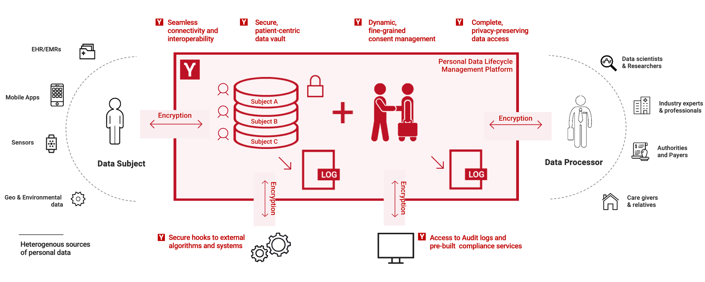

# Open Pryv.io


**Personal Data & Privacy Management Software**

A ready-to-use solution for personal data and consent management.

Pryv.io is a solid foundation on which you build your own digital health solution, so you can collect, store, share and rightfully use personal data.

Maintained and developed by Pryv.



## Features

- Provides latest Pryv.io core system ready for production
- User registration and authentication
- Granular consent-based access control rights
- Data model made for privacy, aggregation and sharing [Data in Pryv](https://pryv.com/data_in_pryv/)
- Full data life-cycle: collect - store - change - delete
- REST & Socket.io API
- Ease of software integration and configuration
- Seamless connectivity and interoperability

## Documentation

- API Documentation & Guides: [api.pryv.com](https://api.pryv.com)
- Support: [support.pryv.com](https://support.pryv.com)
- More information about Pryv : [Pryv Home](https://pryv.com)

## Usage

### Prerequisites

- Node v12.13.1 [Node.js home page](https://nodejs.org/)
- Yarn v1 `npm install -g yarn`

### Install

Install script as been tested on Linux Ubuntu 18.04 LTS and MacOSX.

- `yarn setup`: (see `scripts/` for details)
  - Fetch dependencies
  - Install mongodb
  - Install service mail
  - Install assets & app-web-auth3
  - Generate random alpha-numeric adminKey
- `yarn release` create distribution for release

### Configure your installatiom

Pryv.io is designed to be exposed by a third party SSL temination such as NGINX.

#### Open Pryv.io configuration

Edit the `config.json` file:

```json
{
  "dnsLess": {
    "publicUrl":  "http://localhost:3000"
  },
  "http": {
    "port": 3000,
    "ip": "127.0.0.1"
  },
  "auth": {
    "adminAccessKey": "randomstring",
    "trustedApps": "*@http://pryv.github.io, *@https://*.rec.la*"
  },
  "eventFiles": {
    "attachmentsDirPath": "var-pryv/attachment-files"
  },
  "service": {
    "name": "Test",
    "support": "https://pryv.com/openpryv/unconfigured.html",
    "terms": "https://pryv.com/openpryv/unconfigured.html",
    "home": "https://pryv.com/openpryv/unconfigured.html",
    "eventTypes": "https://api.pryv.com/event-types/flat.json",
    "assets": {
      "definitions": "https://http://localhost:3000/wwww/assets/index.json"
    }
  },
  "services": {
    "email": {
      "enabled": {
        "welcome": true,
        "resetPassword": true
      }
    }
  }
}
```

- **publicUrl** Is the "Public" URL to reach the service, usually exposed in **https** by a third party SSL service such as NGNIX.
- **http**
  - **port** The local port to listen
  - **ip** The IP adress to use. Keep it 127.0.0.1 unless you explicitely want to expose the service in `http` to another network.
- **auth**
  - **adminAccesskey** key to use for system calls such as `/reg/admin/users`. A random key should be generated on setup.
  - **trustedApps** list of web apps that can be trusted-app functionalities
     API for trusted apps: [API reference](https://api.pryv.com/reference/)
    see: [SETUP Guide - customize authorization](https://api.pryv.com/customer-resources/pryv.io-setup/#customize-authorization-registration-and-reset-password-apps)
- **eventFiles**
  - **attachmentsDirPath** Directory where event attachment files will be stored on the file system.
- **service** [API documention on Service Information](https://api.pryv.com/reference/#service-info)
- **services:email** see [Options & Customization](#custom-email) bellow

#### NGINX configuration

You can find a NGINX configuration that you can include in your `sites-enabled/` in [configs/site.conf](configs/site.conf).

You must change `${PUBLIC_URL}` to match the `dnsLess:publicUrl` setting in the Pryv.io configuration.

##### SSL certificate

Using [certbot](https://certbot.eff.org/), you can generate a SSL certificate for your platform using `sudo certbot --nginx -d ${PUBLIC_URL}`.

To set an automatic renewal, run `crontab -e` and append the following line:

```cron
0 12 * * * /usr/bin/certbot renew --quiet
```

### Run

All services in a single command line

- `yarn pryv`  - mail and database logs will be kept in `var-pryv/logs/local-*.log`

Each service independently - logs will be displayed on the console

- `yarn database` start mongodb
- `yarn api` start the API server on port 3000 (default)
- `yarn mail` start the mail service

#### For development and debugging purposes 

- `yarn proxy` based on [rec-la](https://github.com/pryv/rec-la) will expose the server running on http://localhost:3000 with an SSL certificate on https://l.rec.la:4443 in this case you might want to use `configs/rec-la.json` 
- `yarn local` is the equivalent of running `yarn pryv` + `yarn proxy` using `configs/rec-la.json`
  This setup is useful to test Open Pryv.io locally. Once started you can test the authorization process on [App-Web-Access](http://api.pryv.com/app-web-access/?pryvServiceInfoUrl=https://l.rec.la:4443/reg/service/info) the `pryvServiceInfoUrl` being: [https://l.rec.la:4443/reg/service/info](https://l.rec.la:4443/reg/service/info)

### Options & Customization

#### Authentication & Registration web app.

Open Pryv.io comes packaged with [app-web-auth3](https://github.com/pryv/app-web-auth3), the web pages for app authorization, user registration and password reset.

During the set-up process it has been built and published in `public_html/access/`. To customize it, refer to its `README` in `app-web-auth3/`.

To use a new build, simply copy the contents of the generated files from `app-web-auth3/dist/` to `public_html/access/`

#### Visual assets and icons

Your platforms visuals can be customized in `public_html/assets/`, please refer to the README inside. These assets are a clone of the [assets-pryv.me](https://github.com/pryv/assets-pryv.me) repository.

#### E-Mails<a name="custom-email"></a>

Pryv.io can send e-mails at registration and password reset request.

The emails can be sent either by local sendmail (default) or SMTP. 

This service, its documentation and mail templates can be found in `service-mail/`.

## Contributing

Open Pryv.io is developped and maintained by Pryv's team. You may contact us to submit a change or adaptation but do not be offended if we decline it or decide to re-write it.

#
# License
Copyright (c) 2020 Pryv S.A. https://pryv.com

This file is part of Open-Pryv.io and released under BSD-Clause-3 License

Redistribution and use in source and binary forms, with or without 
modification, are permitted provided that the following conditions are met:

1. Redistributions of source code must retain the above copyright notice, 
   this list of conditions and the following disclaimer.

2. Redistributions in binary form must reproduce the above copyright notice, 
   this list of conditions and the following disclaimer in the documentation 
   and/or other materials provided with the distribution.

3. Neither the name of the copyright holder nor the names of its contributors 
   may be used to endorse or promote products derived from this software 
   without specific prior written permission.

THIS SOFTWARE IS PROVIDED BY THE COPYRIGHT HOLDERS AND CONTRIBUTORS "AS IS" 
AND ANY EXPRESS OR IMPLIED WARRANTIES, INCLUDING, BUT NOT LIMITED TO, THE 
IMPLIED WARRANTIES OF MERCHANTABILITY AND FITNESS FOR A PARTICULAR PURPOSE ARE 
DISCLAIMED. IN NO EVENT SHALL THE COPYRIGHT HOLDER OR CONTRIBUTORS BE LIABLE 
FOR ANY DIRECT, INDIRECT, INCIDENTAL, SPECIAL, EXEMPLARY, OR CONSEQUENTIAL 
DAMAGES (INCLUDING, BUT NOT LIMITED TO, PROCUREMENT OF SUBSTITUTE GOODS OR 
SERVICES; LOSS OF USE, DATA, OR PROFITS; OR BUSINESS INTERRUPTION) HOWEVER 
CAUSED AND ON ANY THEORY OF LIABILITY, WHETHER IN CONTRACT, STRICT LIABILITY, 
OR TORT (INCLUDING NEGLIGENCE OR OTHERWISE) ARISING IN ANY WAY OUT OF THE USE 
OF THIS SOFTWARE, EVEN IF ADVISED OF THE POSSIBILITY OF SUCH DAMAGE.

SPDX-License-Identifier: BSD-3-Clause
