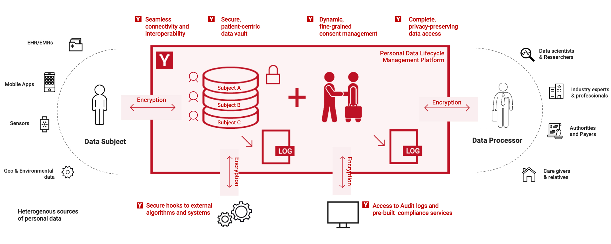

# Open Pryv.io v2.0.0-pre


**Personal data & privacy management — open source**

[](https://digitalpublicgoods.net/registry/pryv-io.html)

> **Pre-release warning:** This is the v2 pre-release of Open Pryv.io. It is under active development and not yet recommended for production workloads. For the last stable v1 release, see the [`release/1.9.3`](https://github.com/pryv/open-pryv.io/tree/release/1.9.3) branch.

## What is Pryv.io

Pryv.io is a data privacy management solution designed to collect, store and share personal data in compliance with privacy regulations (GDPR, HIPAA, LPD). It provides a RESTful API for managing user data organized into streams (hierarchical categories) and events (timestamped data points), with fine-grained access controls and real-time notifications.

Pryv.io serves as the backend for applications in health, quantified self, smart cities, and any domain requiring data sovereignty and consent management. Each user's data is isolated and access-controlled independently.



## What's new in v2

- **Pluggable storage engines** — MongoDB, PostgreSQL, SQLite, InfluxDB, filesystem, rqlite. Engines are plugins under `storages/engines/` with manifest-driven configuration.
- **Unified master process** — single `bin/master.js` manages N API workers + M HFS workers + optional previews worker. Single Docker image replaces multi-container orchestration.
- **Built-in user registration** — no external service-register needed. Registration fully self-contained via PlatformDB.
- **Built-in MFA** — SMS-based two-factor authentication as `mfa.*` API methods.
- **rqlite for PlatformDB** — distributed platform storage for single- and multi-core deployments with Raft consensus.
- **Multi-core deployments** — HTTP 421 wrong-core routing, DNS-based or DNSless topology, platform-config-snapshot hash comparison for drift detection.
- **Backup, restore & integrity** — engine-agnostic backup to JSONL+gzip, per-user integrity verification with SHA-256 hashes.
- **Optional observability (APM)** — pluggable provider façade with New Relic as the first integration. Opt-in, cluster-wide config via PlatformDB (license key AES-256-GCM encrypted at rest), errors-only by default, hostnames matching `/reg/hostings`. Operator guide: [Observability (APM)](https://pryv.github.io/customer-resources/observability/).

For the full v2 change history, see [CHANGELOG-v2.md](./CHANGELOG-v2.md) (API-facing) and [CHANGELOG-v2-back.md](./CHANGELOG-v2-back.md) (internal).

## Quick start — single-core with Docker

```bash
docker run -d --name pryv-core \
  -p 3000:3000 \
  -e http__ip=0.0.0.0 \
  -e dnsLess__isActive=true \
  -e "dnsLess__publicUrl=http://localhost:3000/" \
  -e auth__adminAccessKey=my-admin-key \
  pryvio/open-pryv.io:2.0.0-pre
```

Test it:
```bash
curl http://localhost:3000/
# {"meta":{"apiVersion":"..."},"cheersFrom":"Pryv API","learnMoreAt":"https://pryv.github.io/"}
```

For a complete Docker deployment with PostgreSQL, see [INSTALL.md](./INSTALL.md).

## Native installation

Prerequisites: Node.js 22.x, MongoDB 4.2+ or PostgreSQL 14+, [just](https://github.com/casey/just#installation).

```bash
just setup-dev-env    # setup local file structure + MongoDB
just install          # install node modules
just start-master     # start in cluster mode
```

See [INSTALL.md](./INSTALL.md) for detailed instructions.

## Multi-core deployment

See [SINGLE-TO-MULTIPLE.md](./SINGLE-TO-MULTIPLE.md) for the full upgrade procedure from single-core to multi-core.

## Email integration (service-mail)

For email features (welcome emails, password reset), run [service-mail](https://github.com/pryv/service-mail) as a separate service and configure:

```yaml
services:
  email:
    enabled:
      welcome: true
      resetPassword: true
    method: microservice
    url: http://service-mail-host:9000/sendmail/
```

For local development convenience:
```bash
just mail-dev    # clones and starts service-mail locally
```

## Data migration from v1

To migrate data from a v1 (open-pryv.io 1.x) deployment to v2, use [dev-migrate-v1-v2](https://github.com/pryv/dev-migrate-v1-v2). The migration tool handles schema differences between v1 and v2 storage formats.

## Architecture

```
node bin/master.js
  |
  +-- Master process
  |   +-- rqlited (PlatformDB, Raft consensus)
  |   +-- TCP pub/sub broker (:4222)
  |   +-- Process manager (fork/monitor workers)
  |
  +-- N x API Worker (cluster, shared :3000)
  |   +-- API routes (events, streams, accesses, auth, ...)
  |   +-- Socket.IO (real-time notifications)
  |   +-- Webhooks subscriber (in-process)
  |
  +-- M x HFS Worker (cluster, shared :4000, 0 = disabled)
  |   +-- Series routes (high-frequency data)
  |   +-- Metadata updater (in-process)
  |
  +-- 0-1 x Previews Worker (:3001, lazy/optional)
```

### Storage engines

| Engine | Storage types | Status |
|--------|--------------|--------|
| MongoDB | base, dataStore | Production |
| PostgreSQL | base, dataStore, series, audit | Production |
| SQLite | dataStore (per-user), user account, user index, audit | Production |
| rqlite | platform (single- and multi-core) | Production |
| Filesystem | file (attachments) | Production |
| InfluxDB | series (HFS) | Production |

### Project structure

```
open-pryv.io/
+-- bin/                    # Entry points
|   +-- master.js           # Cluster master (N API workers)
|   +-- backup.js           # Backup/restore CLI
|   +-- integrity-check.js  # Data integrity verification CLI
+-- components/             # Application components (npm workspaces)
|   +-- api-server/         # Main API server
|   +-- hfs-server/         # High-frequency series server
|   +-- previews-server/    # Image previews
|   +-- business/           # Business logic
|   +-- storage/            # Storage abstraction layer
|   +-- mall/               # Data access layer
|   +-- cache/              # Caching
|   +-- messages/           # TCP pub/sub
|   +-- audit/              # Audit logging
|   +-- middleware/         # Express middleware
|   +-- webhooks/           # Webhook business logic (runs in api-server)
|   +-- test-helpers/       # Test infrastructure
+-- storages/               # Plugin system (npm workspace)
|   +-- engines/            # mongodb, postgresql, sqlite, filesystem, influxdb, rqlite
|   +-- interfaces/         # Formal contracts per storage type
+-- config/                 # Default and environment configs
+-- Dockerfile              # Single-image Docker build
+-- justfile                # Development commands
```

## Testing

```bash
just test all                     # all components (MongoDB)
just test api-server              # single component
just test-pg all                  # PostgreSQL mode
just test-parallel all            # parallel file execution
just clean-test-data              # reset test databases
```

## Documentation

- [Pryv.io API reference](https://pryv.github.io/)
- [Pryv home](https://pryv.com)
- [GitHub Discussions](https://github.com/pryv/open-pryv.io/discussions)


# License

[BSD-3-Clause](LICENSE)
