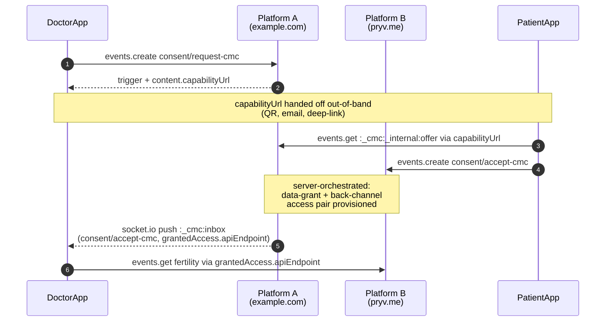
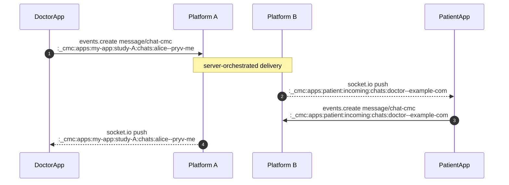
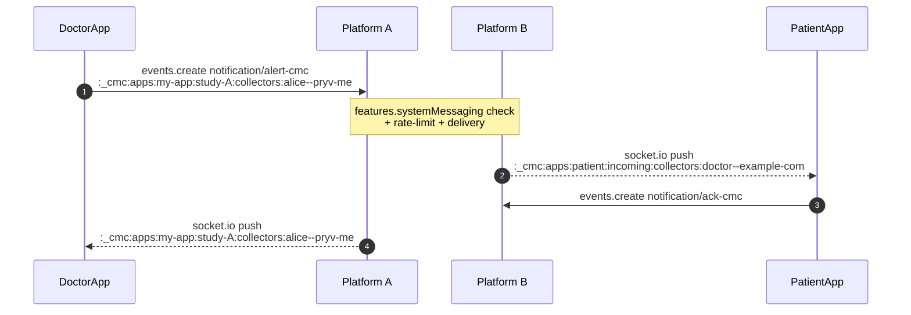
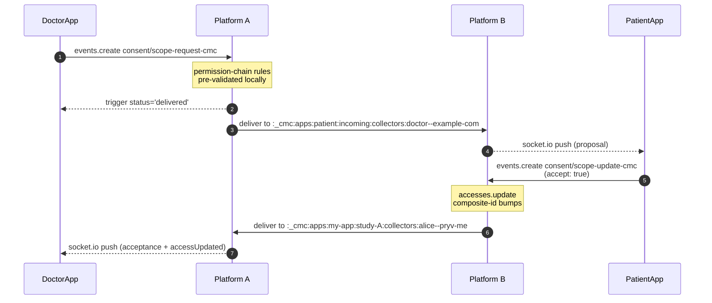
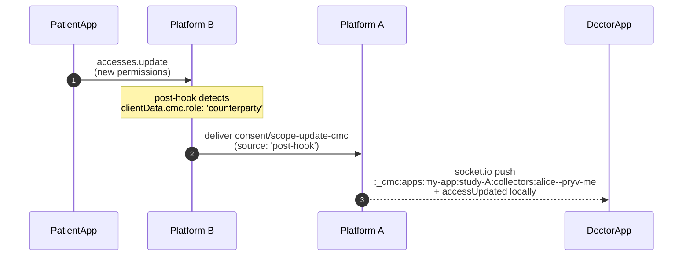

# Cross-Account Messaging & Consent — Implementer's Guide

> **Design locked 2026-05-13.** Plugin-orchestrated single-write-per-action model with federation-friendly cross-platform support. This document is the canonical wire-shape reference for CMC and will become a public page on `pryv.github.io` when the implementation ships.

## Elevator pitch

If you're building anything where **one Pryv user needs to ask another for data access** — a clinician asking a user.to share symptoms, a researcher inviting participants to a study, a partner service onboarding new users, an operator pushing alerts to a population — this primitive is for you.

It replaces the "create a shared access, write a request event on a public stream, hand the apiEndpoint over via QR code, poll an inbox stream for the response" pattern that most Pryv-based apps end up reinventing. Pryv now ships that workflow natively, exposed through one reserved stream plus event types you write in your own organizational streams. **No new API methods**.

The same protocol works across **independent open-pryv.io platforms** with different domains, different operators, different topologies (`dnsLess: true` vs `false`) — without shared trust, federation auth, or pre-arranged inter-operator setup.

**The single rule for app developers:** every action — publishing a request, accepting it, revoking, scope-update, chat, system alert — is **one `events.create` on the user's own platform**. The plugin orchestrates everything else, including cross-platform calls.

## What this solves

| Today, on plain Pryv | With `:_cmc:` |
|---|---|
| Build a per-collector tree of 7 sub-streams (`-public`, `-inbox`, `-pending`, `-active`, …) | Use any organization of streams you like under `:_cmc:apps:` (`streams.create({parentId: ':_cmc:apps'})`). Chat and system streams are plugin-managed and auto-created at acceptance. |
| Create a `shared` access with `create-only` on inbox so recipients can write responses | Plugin mints a capability access automatically when you publish a request. The access's apiEndpoint IS the invite URL. |
| Poll `events.get` on the inbox to see replies | Subscribe via socket.io to `:_cmc:inbox`. Push, not poll. |
| Permission change = `accesses.delete` + `accesses.create` + chain `previousAccessIds` for audit | Write a `consent/scope-request-cmc` (collector side) or `consent/scope-update-cmc` (user side), or just call `accesses.update` directly — the plugin's post-hook auto-notifies the counterparty. Audit history preserved by composite-id versioning. |
| Hand off invite as `https://<token>@<host>` (the token is in the URL — leakage = compromise) | Hand off the capability access's apiEndpoint — single-event scoped, TTL-bounded, single-use. |
| Each acceptance: N×`streams.create` + `accesses.create`, no transaction | Plugin provisions atomically when it processes `consent/accept-cmc`. |
| Untyped `clientData.cmcCollector.{public,inbox}.streamId` discovery contract | Typed event-type schemas validated server-side. |
| App tracks and coordinates two writes (one local, one on counterparty's account) per action | One write per action on the user's own platform. Plugin handles the rest. |
| Cross-platform doesn't work | Cross-platform is a first-class supported case. |

## Mental model

The `:_cmc:` namespace has **two plugin-managed top-level regions** plus user-creatable sub-streams under `:_cmc:apps`. The chat and system anchors live nested **under whichever app-scope stream the trigger was written to**, so an app's access scoped at `:_cmc:apps:<app-code>:*` (whole app) or `:_cmc:apps:<app-code>:<request-slug>:*` (per-request) automatically covers the matching chat/system streams by prefix-match:

| Region | Created by | Holds |
|---|---|---|
| **`:_cmc:inbox`** | server (always present) | One-shot lifecycle events delivered to you: `consent/request-cmc`, `consent/accept-cmc`, `consent/refuse-cmc`, `consent/revoke-cmc`. **Plugin-internal-write-only** — apps never write here. |
| **`:_cmc:apps:<anything-you-create>`** | you via `streams.create({parentId: ':_cmc:apps'})` (and deeper) | Your own organizational scopes for one-shot lifecycle triggers (publish requests, accept invites, revoke). Nest as deep as you like — `:_cmc:apps:my-app:study-A`, `:_cmc:apps:patient:incoming`, etc. The plugin doesn't reserve names under `:_cmc:apps` (except for the auto-created `chats` / `collectors` sub-segments below). |
| **`:_cmc:apps:<app-code>:[<path>:]chats:<counterparty-slug>`** | plugin (auto-created on first chat) | All `message/chat-cmc` events — both sent and received — for one specific counterparty under this app/path. One thread per user-pair per app-scope. |
| **`:_cmc:apps:<app-code>:[<path>:]collectors:<counterparty-slug>`** | plugin (auto-created at acceptance) | The system channel for one specific collector-relationship: `notification/alert-cmc`, `notification/ack-cmc`, `consent/scope-request-cmc`, `consent/scope-update-cmc`. A study's reminders don't bleed into clinical-care alerts from the same doctor. |

The parent streams `:_cmc:`, `:_cmc:inbox`, and `:_cmc:apps` always exist (plugin-managed); you can't `streams.create` / `update` / `delete` them directly. The `chats` / `collectors` sub-segments anywhere under `:_cmc:apps:<app-code>:...` are also plugin-managed (auto-created on demand). The only place you can `streams.create` under `:_cmc:` is inside `:_cmc:apps` (and not inside the plugin-reserved `chats` / `collectors` sub-segments).

### Slug conventions

Cross-platform identity is required in the slug — `alice` on `example.com` and `alice` on another host are different people:

- **`<counterparty-slug>`** = `<username>--<host-slug>` where `host-slug` replaces `.` with `-`. Double-hyphen (`--`) is the load-bearing separator; usernames and host-slugs use single hyphens so `--` is unambiguous.
  - Examples: `alice--example-com`, `bob--my-host-example-org`.
- The same `<counterparty-slug>` shape is used both for chat (`:chats:<counterparty-slug>`) and for system/collector relationships (`:collectors:<counterparty-slug>`) — the app-code and any per-request scoping live in the stream PATH, not in the slug.
- Helper `pryv.cmc.counterpartySlug({username, host})` ships in `lib-js` / `legacy-shim`.

### Where to write each event type

The plugin dispatches based on event type AND target stream:

| Event family | App writes to | Why anchored there |
|---|---|---|
| **Lifecycle** (`consent/request-cmc`, `consent/accept-cmc`, `consent/refuse-cmc`, `consent/revoke-cmc`) | A user-managed `:_cmc:apps:*` stream you create (e.g. `:_cmc:apps:my-app:study-A`). | One-shot — at request time you might not yet have a stable per-counterparty home (an open invite to nobody-in-particular). |
| **Chat** (`message/chat-cmc`) | The anchored `:_cmc:apps:<app-code>:[<path>:]chats:<counterparty-slug>` stream (nested under whichever app-scope stream the original request/accept was written to). | One thread per user-pair per app-scope; sent and received chat events live in the same stream on each side. |
| **System** (`notification/alert-cmc`, `notification/ack-cmc`, `consent/scope-request-cmc`, `consent/scope-update-cmc`) | The anchored `:_cmc:apps:<app-code>:[<path>:]collectors:<counterparty-slug>` stream (same nesting as chat). | System messages and scope-change history live where the collector-relationship itself lives. |

The plugin reads each `cmc/*` write as an **action trigger**, performs the local state change, and (if the action affects a counterparty) delivers the corresponding event to the counterparty's matching anchored stream (`:_cmc:inbox` for lifecycle, `:_cmc:apps:<their-app>:[<their-path>:]chats:<your-slug>` for chat, `:_cmc:apps:<their-app>:[<their-path>:]collectors:<your-slug>` for system) via stored apiEndpoints. The plugin updates the trigger event's `content.status` as orchestration progresses — your app subscribes via socket.io to see status updates land.

Three event-type families:

| Family | Action event types | Anchor (each side) | What they do |
|---|---|---|---|
| **Requests** | `consent/request-cmc`, `consent/accept-cmc`, `consent/refuse-cmc`, `consent/revoke-cmc` | Trigger: user-managed `:_cmc:apps:*`. Delivered: `:_cmc:inbox`. | Ask another user for data access; recipient accepts/refuses; either party later revokes. |
| **Chat** | `message/chat-cmc` | `:_cmc:apps:<app-code>:[<path>:]chats:<counterparty-slug>` on each side. | Bi-directional messaging between two parties holding an access pair. |
| **System** | `notification/alert-cmc`, `notification/ack-cmc`, `consent/scope-request-cmc`, `consent/scope-update-cmc` | `:_cmc:apps:<app-code>:[<path>:]collectors:<counterparty-slug>` on each side. | Operator alerts + acks; collector-proposed scope changes; user-side scope updates. Recipient must have opted in to system alerts. |

The plugin distinguishes incoming vs outgoing by `content.from`:

- **Trigger you wrote** → `content.from` is absent; you're the actor.
- **Delivered by a counterparty's plugin** → `content.from = { username, host }`, server-stamped from the access's stored counterparty identity. Unforgeable.

## How the federation actually works

The cross-platform support comes from leaning on Pryv's existing shared-access primitive as the federation fabric. There's no new platform-to-platform protocol.

**Pre-acceptance:** the requester's platform mints a **capability access** — a single-event-scoped Pryv shared access on the requester's account. The capability's apiEndpoint is a standard Pryv URL. The recipient's app receives it out-of-band (QR, email, deep-link). The recipient's plugin (when the recipient triggers accept) opens the capability URL, reads the offer, and delivers the accept event through it.

**Acceptance** creates a **bidirectional access pair**:

- Recipient's plugin creates the data-grant access on the recipient's account for the requester.
- Requester's plugin creates a back-channel access on the requester's account for the recipient.
- Each plugin stores the other party's apiEndpoint in `clientData.cmc.counterparty.*` on its local access.

After this, both plugins hold each other's apiEndpoints and have the credentials needed to deliver any future action (chat, scope-update, revoke, system message) to the other party.

**All post-acceptance actions** are single events on the actor's own platform. The actor's plugin reads the trigger, makes the local state change, and uses the stored counterparty apiEndpoint to deliver a corresponding event into the counterparty's `:_cmc:inbox`. The receiving plugin processes the inbox write locally.

**This works identically** for same-core same-platform, cross-core same-platform, and cross-platform. The plugin's outbound HTTPS call goes to whatever host the apiEndpoint points at.

---

# Walkthrough 1 — Provider asks User for data access

The doctor's account on Platform A (`example.com`). The patient's account is on Platform B — could be the same platform, could be a different one (`pryv.me`, `university.edu`, anywhere — the protocol doesn't care).



## Step 1 — Provider creates an organizational scope (once per study)

```js
// Doctor's app, authenticated as the provider on Platform A.
// Create the app root, then the per-study scope under it.
await doctorConnection.api([
  { method: 'streams.create', params: {
      id: ':_cmc:apps:my-app',
      parentId: ':_cmc:apps',
      name: 'My App'
  }},
  { method: 'streams.create', params: {
      id: ':_cmc:apps:my-app:study-A',
      parentId: ':_cmc:apps:my-app',
      name: 'Example Study',
      clientData: { cmc: { kind: 'collector' } }
  }}
]);
```

Plain `streams.create`. The doctor's app organizes its collectors however it likes under `:_cmc:apps:`.

## Step 2 — Provider publishes the request

```js
const result = await doctorConnection.api([
  {
    method: 'events.create',
    params: {
      streamIds: [':_cmc:apps:my-app:study-A'],
      type: 'consent/request-cmc',
      content: {
        to: null,                          // open invite — anyone with the capability URL claims
        capabilityRequested: true,
        request: {
          title:       { en: 'Example consent' },
          description: { en: 'Share fertility + symptom data for 3 months.' },
          consent:     { en: 'I agree to share data with Provider A for the example study.' },
          permissions: [
            { streamId: 'fertility', level: 'read' },
            { streamId: 'symptom',   level: 'read' }
          ],
          features: { chat: true, systemMessaging: false },
          expiresAt: 1736294400
        },
        requesterMeta: {
          displayName: 'Provider A study',
          appId:       'example-app',
          appUrl:      'https://my-app.example.org'
        }
      }
    }
  }
]);

const requestEvent = result[0].event;
// Plugin processed synchronously; event content now contains:
// requestEvent.content.capabilityUrl       → 'https://AbC...Xyz@example.com/'
// requestEvent.content.capabilityExpiresAt → 1735776000
// requestEvent.content.status              → 'pending'
```

The plugin saw the `consent/request-cmc` trigger and:

1. Minted a capability access (`shared`, single-use, TTL-bounded). The access has `read` on a per-capability stream `:_cmc:_internal:offer:<capId>` (which the plugin pre-populates with this one request event) and `create-only` on `:_cmc:_internal:responses:<capId>` (which will receive the recipient's single accept/refuse).
2. Wrote the access's apiEndpoint into the trigger event's `content.capabilityUrl`.

The doctor's app encodes the URL into a QR code, email, deep-link — whatever the operator uses for hand-off.

**Capability TTL.** The capability access expires automatically. The
default lifetime is **7 days** and is currently hardcoded in
[`components/cmc/src/capability.ts`](src/capability.ts)
(`DEFAULT_TTL_SECONDS`). The exact expiry timestamp is stamped on the
trigger event as `content.capabilityExpiresAt` (Unix seconds), so a
sender app can display it on the invite UI. Recipient apps should
check it before opening the URL — a stale URL returns a structured
`invalid-access-token` from the api-server's auth middleware. There
is no operator-facing config knob to override the default today; if
your platform needs longer-lived invites (e.g. patient flows where
the doctor sends an invite weeks before the patient checks email),
open a feature request — the knob is a one-config-key change once
prioritised.

## Step 3 — Patient's app receives the URL and reads the offer

The user.receives the URL on their device. Their app opens it as a plain Pryv connection to read the offer content (so the consent UI can display it):

```js
const cap = new pryv.Connection('https://AbC...Xyz@example.com/');

// Read the offer
const [{ events }] = await cap.api([
  { method: 'events.get', params: { streamIds: [':_cmc:_internal:offer'], limit: 1 } }
]);
const offer = events[0];

// Verify sender identity (good UX)
const accessInfo = await cap.accessInfo();
// accessInfo.user.username = 'alice' on example.com
```

The patient's app renders the consent screen.

## Step 4 — User accepts (single write on patient's own platform)

```js
await patientConnection.api([
  {
    method: 'events.create',
    params: {
      streamIds: [':_cmc:apps:patient:incoming'],
      type: 'consent/accept-cmc',
      content: {
        capabilityUrl: 'https://AbC...Xyz@example.com/',
        extra: { chat: true }                  // optional opt-ins for features the request offered
      }
    }
  }
]);
```

That's the user's only call. Everything else is server-orchestrated by the user's plugin:

1. Reads the offer through the capability connection.
2. Creates the local data-grant access with permissions derived from the offer (default name derived from `requesterMeta.appId` + requester username — override with `content.accessName` if you want).
3. Delivers the accept to the requester's platform via the capability connection.
4. Requester's plugin creates the back-channel access on its side and returns its apiEndpoint.
5. Patient's plugin stores the back-channel apiEndpoint internally on the data-grant access.
6. Patient's plugin updates the trigger event's `content.status`: `'pending'` → `'completed'` (or `'failed'`).

If anything fails (network, capability consumed by someone else, request expired), the trigger's `content.status` becomes `'failed'` with `content.failure.reason`. The local data-grant access is rolled back if the remote acceptance call fails.

**Two-phase access materialization (timing the client should expect).**
Steps 2 and 5 above happen in separate transactions, so the data-grant
access goes through TWO states observable from the patient's side:

| State | `clientData.cmc.role` | `counterparty.apiEndpoint` | `counterparty.remoteChatStreamId` |
|---|---|---|---|
| **Phase 1** — right after step 2 (sync w.r.t. the accept events.create response) | `'data-grant'` | absent | absent |
| **Phase 2** — after step 5 (typically ~50-200 ms later, when the requester's plugin POSTs back `consent/back-channel-cmc` to the patient's `:_cmc:inbox`) | `'data-grant'` | present | present |

Naive client code that polls `accesses.get` and waits only for the
access to exist will see chat/collectors stream-ids as `null` during
Phase 1 and then suddenly populated. If your app intends to send chat
or system messages back to the requester right after acceptance, wait
for `counterparty.remoteChatStreamId` to be populated — not just the
access itself. The simplest signal is the trigger event's
`content.status` transition to `'completed'`, which only fires after
Phase 2 lands.

## Step 5 — Provider sees the acceptance

Doctor's plugin (when it processed the remote accept) also wrote a local copy into doctor's `:_cmc:inbox`:

```js
const monitor = await doctorConnection.monitor();
monitor.subscribe(':_cmc:inbox', (event) => {
  if (event.type === 'consent/accept-cmc') {
    // event.content.from               = { username: 'patient-alice', host: 'pryv.me' }
    // event.content.grantedAccess      = { apiEndpoint: 'https://xYz...PqR@pryv.me/' }
    // event.content.backChannelAccessId = 'def456'  (on doctor's account)
    const user.= new pryv.Connection(event.content.grantedAccess.apiEndpoint);
    const data = await user.api([
      { method: 'events.get', params: { streamIds: ['fertility'], limit: 100 } }
    ]);
  }
});
```

Three writes total (doctor's request trigger, patient's accept trigger, doctor's inbox arrival from server-side delivery), one socket.io push on each side, the capability access auto-consumed.

## Refusal

```js
await patientConnection.api([
  { method: 'events.create', params: {
      streamIds: [':_cmc:apps:patient:incoming'],
      type: 'consent/refuse-cmc',
      content: {
        capabilityUrl: 'https://AbC...Xyz@example.com/',
        reason: { en: 'Not at this time.' }
      }
  }}
]);
```

Patient's plugin delivers refuse via capability. No accesses created.

## Revocation (later)

Either party writes a single event on their own platform:

```js
// User revokes
await patientConnection.api([
  { method: 'events.create', params: {
      streamIds: [':_cmc:apps:patient:revokes'],
      type: 'consent/revoke-cmc',
      content: {
        accessId: 'abc123',                  // the local data-grant's id
        reason: { en: 'Study concluded' }
      }
  }}
]);
```

Patient's plugin:

1. Reads `clientData.cmc.counterparty.backChannelApiEndpoint` from the data-grant access.
2. `accesses.delete` on the local data-grant.
3. Delivers `consent/revoke-cmc` to doctor's `:_cmc:inbox` via the back-channel apiEndpoint.
4. Doctor's plugin (on receipt) `accesses.delete`s the back-channel access on doctor's side.

One write, server-orchestrated dual delete.

## Watching state

The trigger event content IS the state record. Read your own outgoing actions from wherever you wrote them:

```js
const requests = await doctorConnection.api([
  { method: 'events.get', params: {
      streamIds: [':_cmc:apps:my-app:study-A'],
      types: ['consent/request-cmc'],
      limit: 100
  }}
]);

// Each event's content.status is one of:
//   'pending' | 'delivered' | 'completed' | 'failed'
// On completion: content.acceptedBy = { username, host }, content.accessIds = { dataGrant, backChannel }
// On failure:    content.failure   = { reason, detail? }
```

Subscribe to your trigger streams via the standard socket.io monitor to see status updates land in real time.

*(A cross-scope summary projection — "all my outgoing actions across all studies" — is on the v2 roadmap. For v1, apps that need cross-scope views aggregate by reading from `:_cmc:` recursively.)*

---

# Walkthrough 2 — Provider and user.chat

Chat is anchored **per user-pair per app-scope**: there's one stream on each side, `:_cmc:apps:<app-code>:[<path>:]chats:<counterparty-slug>`, nested under whichever app-scope stream the original request/accept was written to, holding both sent and received `message/chat-cmc` events for that one counterparty. The plugin creates these streams automatically the first time chat happens between the two parties (typically at acceptance time, since both sides have a slug as soon as the access pair exists).



Each party writes a single event into their own per-counterparty chat stream. The plugin delivers to the matching stream on the other side.

```js
// Provider on example.com chats with user.Alice on pryv.me.
// Doctor's slug for Alice: 'alice--pryv-me'.
// Alice's slug for the provider: 'doctor--example-com'.

// Provider sends
await doctorConnection.api([
  { method: 'events.create', params: {
      streamIds: [':_cmc:apps:my-app:study-A:chats:alice--pryv-me'],
      type: 'message/chat-cmc',
      content: { content: 'How are you feeling today?' }
  }}
]);
// Doctor's plugin resolves the access pair for counterparty alice on pryv.me,
// reads the back-channel access's stored counterparty apiEndpoint,
// delivers the chat to Alice's matching :chats:doctor--example-com stream
// nested under whichever app-scope stream Alice's accept was written to.

// User sends
await patientConnection.api([
  { method: 'events.create', params: {
      streamIds: [':_cmc:apps:patient:incoming:chats:doctor--example-com'],
      type: 'message/chat-cmc',
      content: { content: 'Better, thanks. Slight headache yesterday.' }
  }}
]);
// Patient's plugin does the symmetric resolution and delivers to
// doctor's :_cmc:apps:my-app:study-A:chats:alice--pryv-me stream.
```

**Sent and received chat events live in the same stream on each side.** Reading the full conversation history is just an `events.get` on one stream — no need to fan out across multiple stream ids:

```js
const history = await doctorConnection.api([
  { method: 'events.get', params: {
      streamIds: [':_cmc:apps:my-app:study-A:chats:alice--pryv-me'],
      types: ['message/chat-cmc'],
      sortAscending: true,
      limit: 500
  }}
]);
// Each event's content.from distinguishes incoming (server-stamped) from
// outgoing (absent — your own writes).
```

Subscribing to chat with one counterparty:

```js
monitor.subscribe(':_cmc:apps:my-app:study-A:chats:alice--pryv-me', (event) => { /* render */ });
```

Subscribing to all chat activity for one app-scope (recursive — picks up all counterparties and nested per-request scopes):

```js
monitor.subscribe(':_cmc:apps:my-app', (event) => {
  // event.streamIds tells you which sub-stream (chat, collector, lifecycle, etc.)
});
```

The plugin uses `lib-js` / `legacy-shim` helpers to compute slugs deterministically so apps don't roll their own:

```js
const slug = pryv.cmc.counterpartySlug({ username: 'alice', host: 'pryv.me' });
// → 'alice--pryv-me'
```

**Different app-scopes with the same counterparty get independent chat streams.** If Provider A runs both the example study (`:_cmc:apps:my-app:study-A`) and a separate clinical-care relationship (`:_cmc:apps:my-app:clinical`) with Alice, each relationship's chat events live under its own scope path: `:_cmc:apps:my-app:study-A:chats:alice--pryv-me` and `:_cmc:apps:my-app:clinical:chats:alice--pryv-me`. This falls out naturally from the per-request access scoping — an access scoped to one sub-tree only sees the chat under that sub-tree. System-level distinctions (which study? which collector?) similarly live on each scope's own `:_cmc:apps:<app-code>:[<path>:]collectors:<counterparty-slug>` stream.

---

# Walkthrough 3 — The system channel (alerts, acks, scope-request, scope-update)

The system channel is anchored **per collector-relationship**: `:_cmc:apps:<app-code>:[<path>:]collectors:<counterparty-slug>` on each side. All four system event types share that one stream so a study's reminders don't bleed into clinical-care alerts from the same doctor, and scope-change history lives where the relationship itself lives. The plugin auto-creates the collector stream at acceptance time, before any system messages can flow.

Using the running example: Provider A (`doctor` on `example.com`) running the example study under app-scope `:_cmc:apps:my-app:study-A`, and user Alice (`alice` on `pryv.me`) who accepted under her own app-scope `:_cmc:apps:patient:incoming`.

- Doctor's collector stream for Alice: `:_cmc:apps:my-app:study-A:collectors:alice--pryv-me`.
- Alice's collector stream for the provider relationship: `:_cmc:apps:patient:incoming:collectors:doctor--example-com`.

Each party writes to their own per-collector stream; the plugin delivers to the matching stream on the other side. App scoping for the relationship lives in the stream PATH (`my-app:study-A`, `patient:incoming`); the slug at the leaf is just the counterparty.

## 3a — Operator pushes an alert; participant acks



```js
// Provider A writes a single event on their own platform
await doctorConnection.api([
  { method: 'events.create', params: {
      streamIds: [':_cmc:apps:my-app:study-A:collectors:alice--pryv-me'],
      type: 'notification/alert-cmc',
      content: {
        level: 'info',                       // 'info' | 'warning' | 'critical'
        title: { en: 'Daily check-in' },
        body:  { en: 'Please complete today\'s symptom questionnaire.' },
        ackRequired: true,
        ackId: 'daily-2026-05-13'
      }
  }}
]);
```

Doctor's plugin:

1. Resolves the access pair for this collector-relationship from the stream id.
2. Verifies the participant's data-grant access (locally) has `clientData.cmc.features.systemMessaging: true`. If not, fails the trigger with `system-messaging-not-permitted`.
3. Enforces rate-limit for this participant.
4. Delivers the alert to Alice's `:_cmc:apps:patient:incoming:collectors:doctor--example-com` stream via the stored apiEndpoint.

Jane's app sees the alert via socket.io and prompts the user to ack:

```js
await patientConnection.api([
  { method: 'events.create', params: {
      streamIds: [':_cmc:apps:patient:incoming:collectors:doctor--example-com'],
      type: 'notification/ack-cmc',
      content: {
        alertEventId: '<inbox event id>',
        ackId: 'daily-2026-05-13'
      }
  }}
]);
```

Jane's plugin delivers the ack to the provider's matching collector stream.

## 3b — Collector proposes a scope change

Provider A wants to widen the access to also include `nutrition`. The collector writes a `consent/scope-request-cmc` on the same collector stream:



```js
await doctorConnection.api([
  { method: 'events.create', params: {
      streamIds: [':_cmc:apps:my-app:study-A:collectors:alice--pryv-me'],
      type: 'consent/scope-request-cmc',
      content: {
        newPermissions: [
          { streamId: 'fertility', level: 'read' },
          { streamId: 'symptom',   level: 'read' },
          { streamId: 'nutrition', level: 'read' }    // new
        ],
        message: { en: 'I would also like to see your nutrition log for context.' }
      }
  }}
]);
```

Doctor's plugin:

1. Resolves the access pair from the collector stream id. The collector's back-channel access points at Alice's data-grant.
2. **Pre-validates permission-chain rules locally** against the provider's app-access — the provider must hold manage rights on the underlying data-grant; the new permissions must be ⊆ the provider's own app permissions.
3. If invalid: updates trigger with `status: 'failed', failure: { reason: 'scope-update-offending-children', detail: [...] }`. Alice never sees a failed request — the provider sees the error immediately.
4. If valid: delivers `consent/scope-request-cmc` to Alice's `:_cmc:apps:patient:incoming:collectors:doctor--example-com` via Alice's data-grant apiEndpoint.
5. Updates trigger with `status: 'delivered'`. Final status `completed` lands when Alice responds.

Jane's app sees the request via socket.io on `:_cmc:apps:patient:incoming:collectors:doctor--example-com` and prompts: "Provider A would like to also access: nutrition. [Accept] [Refuse]".

## 3c — User accepts the scope change

```js
await patientConnection.api([
  { method: 'events.create', params: {
      streamIds: [':_cmc:apps:patient:incoming:collectors:doctor--example-com'],
      type: 'consent/scope-update-cmc',
      content: {
        scopeRequestEventId: '<inbox event id from 3b>',
        accept: true
      }
  }}
]);
```

Jane's plugin:

1. Reads the incoming `consent/scope-request-cmc` event from the same collector stream to identify the access + new permissions.
2. Calls `accesses.update` on the local data-grant access with the new permissions. Composite serial bumps (e.g. `abc123` → `abc123:1`).
3. Delivers `consent/scope-update-cmc` (`accept: true`) to the provider's `:_cmc:apps:my-app:study-A:collectors:alice--pryv-me` via the stored back-channel apiEndpoint.
4. Doctor's plugin (on receipt) emits `accessUpdated` socket event locally so the provider's app sees the new composite-id and refreshed permissions.
5. Alice's plugin updates her trigger with `status: 'completed', newAccessId: 'abc123:1'`.

**To refuse**: `accept: false`. Alice's plugin skips the local `accesses.update` and delivers the refusal — the provider's app gets the negative response on the same collector stream.

`consent/scope-update-cmc` events can also be **user-initiated** without responding to a collector's request — see Walkthrough 4.

---

# Walkthrough 4 — User-initiated scope change via `accesses.update`

A user may decide on their own to widen or narrow a collector's access — without the collector asking. They don't need to write a CMC trigger event for this: the **standard Pryv `accesses.update` API** is the surface they use, and the plugin's post-hook on `accesses.update` automatically notifies the collector via the system channel.



## Step 1 — User updates the access through the standard Pryv API

Jane decides to also share her sleep data with Provider A's example study, without waiting for the provider to ask. Her app (or even the Pryv admin UI — any client holding manage rights) calls `accesses.update` against the data-grant access:

```js
await patientConnection.api([
  { method: 'accesses.update', params: {
      id: 'abc123:1',                        // current composite-id of the data-grant
      update: {
        permissions: [
          { streamId: 'fertility', level: 'read' },
          { streamId: 'symptom',   level: 'read' },
          { streamId: 'nutrition', level: 'read' },
          { streamId: 'sleep',     level: 'read' }   // new — user-added
        ]
      }
  }}
]);
// Returns updated access with composite-id 'abc123:2'.
```

This is plain `accesses.update`. The user's app didn't touch any `cmc/*` event types.

## Step 2 — Plugin's post-hook detects a counterparty access + auto-notifies

The plugin runs a post-hook on every successful `accesses.update`. When the updated access carries `clientData.cmc.role: 'counterparty'`, the post-hook:

1. Reads the stored counterparty `apiEndpoint` and collector-stream-id from `clientData.cmc` on the access.
2. Reads the new permissions from the freshly-updated access.
3. Writes (in-process, on behalf of the user) a `consent/scope-update-cmc` event to Alice's own `:_cmc:apps:patient:incoming:collectors:doctor--example-com` stream — this becomes the user-side audit record.
4. Delivers `consent/scope-update-cmc` (`source: 'user-initiated'`) to Provider A's `:_cmc:apps:my-app:study-A:collectors:alice--pryv-me` via the stored back-channel apiEndpoint.

Provider A's plugin, on receipt:

1. Emits `accessUpdated` socket event locally so the provider's app sees the new composite-id and refreshed permissions.
2. The event lands in the provider's `:_cmc:apps:my-app:study-A:collectors:alice--pryv-me` stream alongside any prior scope-request / alert history.

The doctor's app, subscribed to its app-scope `:_cmc:apps:my-app` (recursive), sees the user-initiated change land:

```js
monitor.subscribe(':_cmc:apps:my-app', (event) => {
  if (event.type === 'consent/scope-update-cmc') {
    // event.content.from           = { username: 'alice', host: 'pryv.me' }
    // event.content.source         = 'user-initiated'  (vs 'response-to-request')
    // event.content.newPermissions = [..., { streamId: 'sleep', level: 'read' }]
    // event.content.newAccessId    = 'abc123:2'
  }
});
```

## Double-fire suppression

When the CMC trigger handler itself calls `accesses.update` (the Walkthrough 3c path — accepting a scope-request), the post-hook **must not** fire a second notification. The plugin marks the trigger-handler's `accesses.update` call so the post-hook skips it; the trigger handler is responsible for its own outbound delivery.

End result: a user-initiated change goes through the post-hook (one notification); a response-to-request change goes through Walkthrough 3c's handler (one notification). The collector's app never sees a duplicate.

## Why this matters

The `accesses.update` post-hook means **every** scope change on a CMC counterparty access surfaces on the collector-relationship's system channel — whether the user typed in the Pryv admin UI, wrote a `consent/scope-update-cmc` trigger directly, or accepted a `consent/scope-request-cmc`. The collector's app has one place to watch for "what's the current permission set on Alice's data-grant?" and it stays accurate through any user-side change path.

---

# Federation across platforms

The walkthroughs above work **identically** whether the parties are on:

- **The same core of the same platform.** Plugin's outbound delivery is an in-process write (no HTTPS round-trip).
- **Different cores of the same platform.** Plugin's outbound delivery is an HTTPS call to the sibling core, same standard path as cross-platform. No dedicated cross-core auth lane — the access token in the apiEndpoint is the auth.
- **Independent platforms run by different operators.** Plugin's outbound delivery is an HTTPS call to whatever host the counterparty's apiEndpoint points at. No federation auth — the apiEndpoint already carries an access token granted at acceptance.

**There is no platform-to-platform protocol.** The bidirectional access pair created at acceptance IS the federation. Every subsequent action is a single trigger on the actor's platform; the actor's plugin uses the stored counterparty apiEndpoint to deliver to the other side; the receiving plugin processes locally.

**Topology variation** (`dnsLess: true` vs `false`) is invisible because all addressing is through `apiEndpoint` URLs.

## The one limitation: directed cross-platform invites

If the provider writes `consent/request-cmc` with `to: 'alice@example.com'` while sitting on `example.com`:

- The plugin on `example.com` can mint the capability access (local action) but cannot push a notification into Alice's `:_cmc:inbox` on `pryv.me` — no access pair exists yet, so the plugin has no apiEndpoint to deliver to.
- The capability URL is still minted. Hand-off via email/QR/operator-specific channel is required.

**Same-platform directed invites** (where the recipient is local) DO auto-deliver because the plugin can write in-process. The capability URL still works as a fallback.

When the future OAuth2 / app-accounts work ships signed inter-platform notifications + `/.well-known/cmc-invite-webhook`, this gets resolved as a follow-on.

---

# Reference — Event types

**Where to write each `cmc/*` action trigger** — the plugin dispatches on event type AND target stream:

| Event family | Trigger location | Delivery location on counterparty |
|---|---|---|
| **Lifecycle** (`consent/request-cmc`, `consent/accept-cmc`, `consent/refuse-cmc`, `consent/revoke-cmc`) | Any user-managed `:_cmc:apps:*` stream you've created (e.g. `:_cmc:apps:my-app:study-A`). | Counterparty's `:_cmc:inbox`. |
| **Chat** (`message/chat-cmc`) | Your own `:_cmc:apps:<app-code>:[<path>:]chats:<counterparty-slug>` (plugin auto-creates at acceptance, nested under whichever app-scope stream the original request/accept was written to). | Counterparty's matching `:_cmc:apps:<their-app>:[<their-path>:]chats:<your-slug>`. |
| **System** (`notification/alert-cmc`, `notification/ack-cmc`, `consent/scope-request-cmc`, `consent/scope-update-cmc`) | Your own `:_cmc:apps:<app-code>:[<path>:]collectors:<counterparty-slug>` (same nesting as chat). | Counterparty's matching `:_cmc:apps:<their-app>:[<their-path>:]collectors:<your-slug>`. |

**Triggers** (events you write to your own streams):
- `content.from` is absent — you're the actor.
- Plugin updates `content.status` as it orchestrates (`'pending'` → `'delivered'` → `'completed'`, or `'failed'`).

**Incoming** (events delivered to the corresponding anchored stream by counterparty plugins):
- `content.from = { username, host }` is server-stamped, trustworthy, unforgeable.

## Family 1 — Requests (anchored at `:_cmc:inbox` on the delivery side)

### `consent/request-cmc`

```ts
// App writes (trigger content)
{
  to: string | null,                          // null = open invite, capability-URL only
  capabilityRequested?: boolean,
  request: {
    title:       LocalizableText,
    description: LocalizableText,
    consent:     LocalizableText,
    permissions: Permission[],
    features?:   { chat?: boolean, systemMessaging?: boolean },
    expiresAt?:  number,
    customData?: object
  },
  requesterMeta?: { displayName, appId?, appUrl? }
}

// Plugin stamps after orchestration
{
  // ... above ...
  capabilityUrl?: string,
  capabilityExpiresAt?: number,
  capabilityAccessId?: string,
  status: 'pending' | 'delivered' | 'completed' | 'failed',
  failure?: { reason, detail? }
}
```

### `consent/accept-cmc`

```ts
// App writes (minimal)
{
  capabilityUrl: string,                      // received out-of-band
  extra?:        { chat?: boolean, systemMessaging?: boolean },
  accessName?:   string                       // optional override; plugin derives a default
}

// Plugin updates content as orchestration runs
{
  // ... above ...
  status: 'pending' | 'completed' | 'failed',
  dataGrantAccessId?: string,                 // composite-id of the data-grant the plugin created locally
  failure?: { reason, detail? }
}

// What lands in the requester's :_cmc:inbox (delivered by the recipient's plugin)
{
  from: { username, host },
  requestEventId: string,
  grantedAccess: { apiEndpoint: string }
}
```

Everything else (permissions on the data-grant, the back-channel apiEndpoint storage, the access naming default) is plugin-derived from the offer.

### `consent/refuse-cmc`


```ts
// App writes
{
  capabilityUrl: string,
  reason?: LocalizableText
}

// On the requester's :_cmc:inbox
{
  from: { username, host },
  requestEventId: string,
  reason?: LocalizableText
}
```

### `consent/revoke-cmc`


```ts
// App writes
{
  accessId: string,                           // id of the local access (data-grant for recipient; back-channel for requester)
  reason?:  LocalizableText
}

// On the counterparty's :_cmc:inbox
{
  from: { username, host },
  reason?: LocalizableText
}
```

## Family 2 — Chat (anchored at `:_cmc:apps:<app-code>:[<path>:]chats:<counterparty-slug>`)

Sent and received chat events live in the same per-counterparty stream on each side, nested under whichever app-scope stream the trigger was written to. The stream id encodes both the app-scope and the counterparty; no per-event `counterpartyAccessId` is needed.

### `message/chat-cmc`

```ts
// App writes to its own :_cmc:apps:my-app:chats:<counterparty-slug> stream
// (or a deeper per-request scope, e.g. :_cmc:apps:my-app:study-A:chats:<counterparty-slug>)
{
  content: string                              // markdown, ≤ 10 KB
}

// On counterparty's matching :_cmc:apps:<their-app>:chats:<your-slug> stream
// (server-stamped on delivery)
{
  from: { username, host },
  content: string
}
```

## Family 3 — System messages, incl. scope-update (anchored at `:_cmc:apps:<app-code>:[<path>:]collectors:<counterparty-slug>`)

The four system event types share one stream per collector-relationship, nested under whichever app-scope stream the trigger was written to. The stream id encodes both the app-scope and the counterparty, so no per-event `counterpartyAccessId` is needed.

### `notification/alert-cmc`

```ts
// App writes to its own :_cmc:apps:my-app:collectors:<counterparty-slug> stream
// (or a deeper per-request scope)
{
  level: 'info' | 'warning' | 'critical',
  title: LocalizableText,
  body:  LocalizableText,
  ackRequired?: boolean,
  ackId?:       string
}

// On counterparty's matching :_cmc:apps:<their-app>:collectors:<your-slug> stream
{
  from: { username, host },
  level: 'info' | 'warning' | 'critical',
  title: LocalizableText,
  body:  LocalizableText,
  ackRequired?: boolean,
  ackId?:       string
}
```

### `notification/ack-cmc`

```ts
// App writes
{
  alertEventId: string,
  ackId: string
}

// On counterparty's matching :_cmc:apps:<their-app>:collectors:<your-slug> stream
{
  from: { username, host },
  alertEventId: string,
  ackId: string
}
```

### `consent/scope-request-cmc`

The collector → user proposal to widen/narrow/change scope on the data-grant access. Pre-validated against permission-chain rules locally on the collector's side before delivery.

```ts
// App writes (collector side)
{
  newPermissions: Permission[],
  expires?: number,
  message?: LocalizableText
}

// On user's matching :_cmc:apps:<their-app>:collectors:<counterparty-slug> stream
{
  from: { username, host },
  accessId: string,                            // composite-id of the data-grant on user's account
  newPermissions: Permission[],
  previousPermissions: Permission[],
  expires?: number,
  message?: LocalizableText
}
```

### `consent/scope-update-cmc`

The user-side scope change. Triggered three ways: (1) user writes a `consent/scope-update-cmc` in response to a `consent/scope-request-cmc`, (2) user writes one self-initiated (no preceding request), or (3) the `accesses.update` post-hook auto-fires it when the user changes scope through the standard Pryv API (see Walkthrough 4).

```ts
// App writes (when responding to a request OR self-initiated)
{
  scopeRequestEventId?: string,                // present when responding to a system-scope-request-v1
  accept?:              boolean,               // present when responding to a system-scope-request-v1
  newPermissions?:      Permission[]           // present for self-initiated changes
}

// On collector's matching :_cmc:apps:<their-app>:collectors:<user-slug> stream
// (also written locally on user's matching stream)
{
  from:           { username, host },
  source:         'response-to-request' | 'user-initiated' | 'post-hook',
  accept?:        boolean,                     // when source='response-to-request'
  newAccessId?:   string,                      // composite-id after the update (if accept!==false)
  newPermissions: Permission[],
  previousPermissions: Permission[],
  refusalDetails?: { offendingChildren?, reason? }
}
```

`source` tells the collector's app whether the change came from accepting their proposal, from a user-initiated CMC trigger, or from a raw `accesses.update` call (post-hook).

## State as trigger-event content

There's no separate `:_cmc:state` stream in v1. Every action's state lives on the trigger event you wrote, in `content.status` + related fields. The plugin updates these fields as orchestration progresses.

Common content fields the plugin adds/updates on triggers:

```ts
{
  status: 'pending' | 'delivered' | 'completed' | 'failed',
  // On 'completed':
  acceptedBy?:           { username, host },     // for consent/request-cmc once accepted
  accessIds?:            { dataGrant, backChannel },
  dataGrantAccessId?:    string,                 // for consent/accept-cmc
  backChannelAccessId?:  string,                 // for consent/accept-cmc
  newAccessId?:          string,                 // for consent/scope-update-cmc
  // On 'failed':
  failure?: { reason: string, detail?: string }
}
```

Cross-scope projection (`:_cmc:state` summary) is **deferred to v2** — apps that need it can aggregate by reading from their own scope streams in v1.

---

# Reference — Slug conventions

Slugs identify a counterparty in a stream-id. They have to round-trip from `(username, host)` deterministically, be safe inside a Pryv stream-id (allowed character set), and stay unambiguous when split back into their components.

The **same `<counterparty-slug>` shape is used for both chat (`:chats:<counterparty-slug>`) and collector (`:collectors:<counterparty-slug>`) streams.** There is no separate "collector slug" — the per-app scoping that used to live in the slug now lives in the stream PATH (`:_cmc:apps:<app-code>:[<path>:]...`).

## Counterparty slug

```
<counterparty-slug> := <username> '--' <host-slug>
<host-slug>         := <host with '.' replaced by '-'>
```

Examples:

| `(username, host)` | Counterparty slug |
|---|---|
| `('alice', 'example.com')` | `alice--example-com` |
| `('alice', 'pryv.me')` | `alice--pryv-me` |
| `('bob', 'my-host.example.org')` | `bob--my-host-example-org` |
| `('alice-smith', 'sub.example.com')` | `alice-smith--sub-example-com` |

**The load-bearing separator is `--`.** Usernames and host-slugs use single hyphens; the double-hyphen is reserved as the delimiter. Splitting `alice--example-com` on `--` deterministically yields `('alice', 'example-com')`, then converting `host-slug` back to `host` by replacing `-` with `.` only at the host-slug position (not in the username) requires knowing the DNS suffix structure — which is why apps should always use the helper rather than parse by hand.

## App-scope in the path, not the slug

A collector-relationship is uniquely identified by the **(app-scope path, counterparty)** pair, not by a single composite slug. The same counterparty under two different app-scopes is two distinct relationships:

| Stream id | Meaning |
|---|---|
| `:_cmc:apps:my-app:collectors:alice--pryv-me` | the relationship between this app (whole `my-app` scope) and Alice on pryv.me |
| `:_cmc:apps:my-app:study-A:collectors:alice--pryv-me` | a more granular relationship under `my-app`'s `study-A` sub-tree with the same Alice |
| `:_cmc:apps:other-app:collectors:alice--pryv-me` | a different app's relationship with the same Alice — independent |

The app's access can be scoped at `:_cmc:apps:<app-code>:*` to cover the whole app, or at `:_cmc:apps:<app-code>:<request-slug>:*` to cover one specific cross-account relationship. Either way the chat/collectors streams are picked up by simple prefix-match.

## Helpers

`lib-js` and `legacy-shim` ship the deterministic slug helper; apps should never roll their own:

```js
import { cmc } from 'pryv';

const counterparty = cmc.counterpartySlug({ username: 'alice', host: 'pryv.me' });
// → 'alice--pryv-me'

// And the inverse:
const parsed = cmc.parseCounterpartySlug('alice--pryv-me');
// → { username: 'alice', host: 'pryv.me' }
```

## Why the host is in every slug

`alice` on `example.com` and `alice` on another host are **different people**. Cross-platform federation means there's no shared user namespace; the slug must disambiguate by host so the same username on two platforms doesn't collide.

## Stability

Slugs are **stable for the lifetime of the relationship**:

- Username changes are not supported by CMC v1 (would orphan all per-counterparty streams). If the platform ever supports username changes, the plugin must rename anchored streams atomically.
- Host migrations (a platform moving from `old.example.com` to `new.example.com`) are an operator concern; out of scope for v1.
- An app changing its `<app-code>` segment in the stream PATH would also orphan all chat/collector streams under the old code; treat the app-code at the root of `:_cmc:apps:<app-code>` as immutable across a relationship's lifetime.

If any of these change in practice, the existing relationship is preserved on the old slug/path and a new `consent/request-cmc` cycle is the path forward.

---

# Reference — Capability accesses

A capability access is a regular Pryv `shared` access on the requester's account, paired with **two real per-capability streams** the plugin creates alongside it:

- **Type:** `shared`
- **Name:** `__cmc-cap-<short-id>`
- **Per-capability streams** (under the hidden `:_cmc:_internal:` parent):
  - `:_cmc:_internal:offer:<capId>` — bears exactly one event (the request), plugin-pre-populated.
  - `:_cmc:_internal:responses:<capId>` — empty at mint, accepts one accept/refuse during the capability's life.
- **Permissions:**
  - `read` on `:_cmc:_internal:offer:<capId>`
  - `create-only` on `:_cmc:_internal:responses:<capId>`
- **`clientData.cmc`:** `{ kind: 'capability', requestEventId, capabilityId: '<capId>', singleUse: true }`
- **TTL:** 7 days default, operator-configurable, requester-overridable
- **Single-use:** plugin deletes the access AND both per-capability streams on first successful accept/refuse.
- **Hidden:** filtered from `accesses.get` by default. The per-capability streams are likewise plugin-managed and not enumerated by regular `streams.get`.

The access's `apiEndpoint` is the capability URL. The recipient's plugin opens it as a standard `pryv.Connection(url)` during accept orchestration.

## Reading the offer for the consent UI

```js
const cap = new pryv.Connection(capabilityUrl);
const [{ events }] = await cap.api([
  { method: 'events.get', params: { streamIds: [':_cmc:_internal:offer'], limit: 1 } }
]);
```

The patient's app reads from the parent stream `:_cmc:_internal:offer`; recursive expand resolves to the one child the capability access can read, returning exactly one event.

## Re-issuing

```js
await connection.api([
  { method: 'events.update', params: {
      id: '<requestEventId>',
      update: { content: { capabilityRequested: true } }
  }}
]);
```

Plugin mints a new capability; old one stays deleted.

---

# Reference — Counterparty accesses (plugin-internal)

After acceptance, two standard Pryv shared accesses exist (one on each side). They serve as the plugin's outbound-delivery credentials. **You generally don't interact with them from app code.**

The plugin maintains the necessary internal markers (role tagging, counterparty identity, peer apiEndpoint references) on these accesses. The receiving plugin validates incoming deliveries on `:_cmc:inbox` against those markers, stamps `content.from`, and fires socket.io push.

Apps reading `:_cmc:inbox` see `content.from = { username, host }` as the trustworthy sender identity (server-stamped, unforgeable).

*(For engineering-internal details — the `clientData.cmc.role`/`counterparty.*` markers and per-event-type write authorization rules — see the CMC engineering specs.)*

---

# Reference — Trigger event lifecycle and async status

When you write a `cmc/<action>-v1` event to your own `:_cmc:*` scope stream:

1. Returns immediately. Event content shows `status: 'pending'`.
2. Plugin processes asynchronously: local state change + outbound HTTPS to counterparty.
3. Plugin updates the same event's `content.status` as orchestration progresses (`pending` → `delivered` → `completed`, or `failed`).
4. App subscribes via `monitor.subscribe(':_cmc:apps:my-app:...', handler)` to receive status updates.

If the outbound delivery fails (timeout, peer unreachable, peer 4xx/5xx), the plugin queues for retry (rqlite-persisted: `cmc-pending-deliveries/<deliveryId>`). On terminal failure, sets `status: 'failed'` with reason.

```ts
// Trigger event status lifecycle
'pending'    // Plugin received the trigger; local state change not yet applied
'delivered'  // Plugin completed local action + outbound delivery; awaiting counterparty's plugin processing
'completed'  // Counterparty's plugin acknowledged; action fully done
'failed'     // Terminal failure; content.failure has details
```

---

# Reference — Error id catalogue

When a trigger transitions to `status: 'failed'`, `content.failure.reason`
carries a stable kebab-case error id. Match on the **string value** (not
the English `error.message`) to drive per-outcome UX. The full enumeration
ships as `cmc.CmcErrorIds` in the plugin and as `pryv.cmc.errorIds` in
[lib-js](https://github.com/pryv/lib-js).

| Constant | Value | When it fires |
|---|---|---|
| `CAPABILITY_UNKNOWN` | `cmc-capability-unknown` | The capability URL fails authentication (HTTP 401). Today this collapses three runtime cases — token never existed, token expired (post-TTL, plugin-GC'd), token already consumed (single-use after first accept/refuse). The plugin does NOT currently keep tombstones to distinguish stale vs unknown vs already-accepted; the [`07-recapture`](https://github.com/pryv/macroPryv/blob/main/_plans/68-cmc-datastore-atwork/tests/07-recapture.js) HANDOVER probe decides whether tombstones are worth adding for finer outcomes. |
| `CAPABILITY_TIMEOUT` | `cmc-capability-timeout` | Capability fetch took longer than the configured timeout (default 15s). |
| `CAPABILITY_EMPTY` | `cmc-capability-empty` | Capability resolved but the offer stream was empty. Protocol invariant violation — investigate. |
| `CAPABILITY_MULTIPLE_OFFERS` | `cmc-capability-multiple-offers` | Capability resolved but the offer stream held more than one event. Protocol invariant violation. |
| `HANDLER_MISSING_CAPABILITY_URL` | `cmc-handler-missing-capability-url` | The `consent/accept-cmc` (or `consent/refuse-cmc`) trigger event omitted `capabilityUrl`. |
| `HANDLER_OFFER_MISSING_CAPABILITY_ID` | `cmc-handler-offer-missing-capability-id` | The offer event lacked the server-stamped `capabilityId`. |
| `OFFER_EMPTY_PERMISSIONS` | `cmc-offer-empty-permissions` | The offer carried no `request.permissions` array. |
| `HANDLER_WRONG_TYPE` | `cmc-handler-wrong-type` | Dispatch invoked a handler with a trigger whose `.type` doesn't match (defensive — should be unreachable). |
| `HANDLER_THREW` | `cmc-handler-threw` | The handler threw an unexpected exception not classified above. |
| `HANDLER_OFFER_READ_FAILED` | `cmc-handler-offer-read-failed` | `readOfferViaCapability` threw without a more specific id. |
| `HANDLER_COUNTERPARTY_UNKNOWN` | `cmc-handler-counterparty-unknown` | The offer didn't carry enough info to derive `{username, host}`. With bug #18's identity stamping in place this is unreachable in practice. |
| `HANDLER_DATA_GRANT_CREATE_FAILED` | `cmc-handler-data-grant-create-failed` | `mall.accesses.create` rejected the payload. |
| `HANDLER_DATA_GRANT_NO_APIENDPOINT` | `cmc-handler-data-grant-no-apiendpoint` | The created access lacks `apiEndpoint`. Wiring bug — surface for ops. |
| `HANDLER_BUILD_DATA_GRANT_FAILED` | `cmc-handler-build-data-grant-failed` | Building the data-grant payload threw before the access call. |
| `BACK_CHANNEL_CREATE_FAILED` | `cmc-back-channel-create-failed` | Back-channel access mint failed on the requester's side (`handleIncomingAccept`). |
| `HANDLER_DELIVERY_THREW` | `cmc-handler-delivery-threw` | The outbound fetch to the peer threw an exception (network, DNS). |
| `HANDLER_DELIVERY_REJECTED` | `cmc-handler-delivery-rejected` | Peer returned a non-retryable 4xx (excluding 401 on the capability, which becomes `CAPABILITY_UNKNOWN`). |
| `HANDLER_DELIVERY_FAILED` | `cmc-handler-delivery-failed` | Peer returned 5xx, a timeout, or a network error — retryable. |
| `CHAT_STREAM_NOT_CHAT` | `cmc-chat-stream-not-chat` | The chat trigger's streamId doesn't parse as a chats sub-stream under `:_cmc:apps:<app>`. |
| `CHAT_COUNTERPARTY_ACCESS_NOT_FOUND` | `cmc-chat-counterparty-access-not-found` | No counterparty-role access matched the parsed slug. |
| `CHAT_NO_REMOTE_APIENDPOINT` | `cmc-chat-no-remote-apiendpoint` | Counterparty access lacks `apiEndpoint` on `clientData.cmc.counterparty`. Typically the two-phase access materialization hasn't finished — see Step 4 "Two-phase access materialization". |
| `CHAT_NO_REMOTE_CHAT_STREAM` | `cmc-chat-no-remote-chat-stream` | Same, for `remoteChatStreamId`. |
| `CHAT_RATE_LIMITED` | `cmc-chat-rate-limited` | Rate limiter blocked delivery (100/60s per `(source, recipient)` by default). |

**Gaps under discussion** (HANDOVER follow-up): `cmc-capability-stale` (TTL-expired specifically), `cmc-capability-already-accepted`
(re-click on consumed capability), `cmc-handshake-refused`, `cmc-handshake-revoked` — these all require either capability tombstones or a richer access-state machine; see [HANDOVER-RESPONSE.md](https://github.com/pryv/macroPryv/blob/main/_plans/68-cmc-datastore-atwork/HANDOVER-RESPONSE.md) for the design discussion.

---

# Reference — Socket.io subscription

Standard Pryv monitor. Three subscription targets cover all three plugin-managed regions; an additional one on your own user-managed `:_cmc:apps:*` streams covers trigger status updates:

```js
const monitor = await connection.monitor();

// Region 1 — One-shot lifecycle (requests, accepts, refusals, revocations)
monitor.subscribe(':_cmc:inbox', (event) => {
  // event.content.from = { username, host }  ← server-stamped, trustworthy
  // event.type ∈ { 'consent/request-cmc', 'consent/accept-cmc', 'consent/refuse-cmc', 'consent/revoke-cmc' }
});

// Region 2 — All app-scope activity (recursive, covers chat + collectors + lifecycle triggers
// for one app — and per-request nested scopes underneath)
monitor.subscribe(':_cmc:apps:my-app', (event) => {
  // event.streamIds[0] tells you which sub-stream, e.g.:
  //   ':_cmc:apps:my-app:study-A:chats:alice--pryv-me'
  //   ':_cmc:apps:my-app:study-A:collectors:alice--pryv-me'
  //   ':_cmc:apps:my-app:study-A' (your own lifecycle trigger status update)
  // event.type ∈ { 'consent/request-cmc', 'consent/accept-cmc', 'message/chat-cmc',
  //                'notification/alert-cmc', ... }
});

// Or narrow to one feature class by subscribing to the nested chats / collectors parent
// (these live under a specific app-scope path, NOT at the top of :_cmc:):
monitor.subscribe(':_cmc:apps:my-app:study-A:chats', (event) => {
  // event.streamIds[0] identifies the counterparty stream,
  // e.g. ':_cmc:apps:my-app:study-A:chats:alice--pryv-me'
  // event.content.from set ⇒ incoming; absent ⇒ your own outgoing
  // event.type === 'message/chat-cmc'
});

monitor.subscribe(':_cmc:apps:my-app:study-A:collectors', (event) => {
  // event.streamIds[0] identifies the collector-relationship,
  // e.g. ':_cmc:apps:my-app:study-A:collectors:alice--pryv-me'
  // event.type ∈ { 'notification/alert-cmc', 'notification/ack-cmc',
  //                'consent/scope-request-cmc', 'consent/scope-update-cmc' }
  // event.content.source on scope-updates: 'response-to-request' | 'user-initiated' | 'post-hook'
});
```

Subscribe to a single counterparty / collector stream when the UI is scoped that way:

```js
monitor.subscribe(':_cmc:apps:my-app:study-A:chats:alice--pryv-me', renderChatMessage);
monitor.subscribe(':_cmc:apps:my-app:study-A:collectors:alice--pryv-me', renderSystemMessage);
```

The same callback runs whether the counterparty is on your same core, your same cluster, or a foreign platform — the plugin abstracts the difference. Your app doesn't branch on topology.

---

# Reference — Error catalogue

| Error id | Where surfaced | Meaning | Action |
|---|---|---|---|
| `cmc-plugin-not-installed` | trigger create | Operator hasn't installed the CMC plugin (the `:_cmc:` namespace isn't registered with the mall dispatcher on this core). | Fall back to legacy flow. |
| `reserved-stream` | trigger create | Tried to mutate one of the plugin-managed parents (`:_cmc:` / `:_cmc:inbox` / `:_cmc:apps` / `:_cmc:_internal`), or tried to create a stream whose path uses a plugin-reserved sub-segment (`chats` or `collectors`) under `:_cmc:apps:<app-code>:...`, or tried to `streams.create` directly under `:_cmc:` outside `:_cmc:apps`. | Create user streams under `:_cmc:apps` (`streams.create({parentId: ':_cmc:apps'})`); use the plugin-managed `:_cmc:apps:<app-code>:[<path>:]chats:<slug>` / `:_cmc:apps:<app-code>:[<path>:]collectors:<slug>` streams that the plugin auto-creates at acceptance. |
| `invalid-event-type` | trigger create | `type` not a known `cmc/*`. | Fix spelling. |
| `event-validation-failed` | trigger create | Content schema mismatch. | Fix payload. |
| `cmc-not-counterparty` | inbox delivery (plugin internal) | Plugin rejected an inbound write — actor isn't a counterparty access. Shouldn't be visible to apps unless your access lost its counterparty marker. | Check `clientData.cmc.role` on the access. |
| `cmc-event-type-not-allowed` | inbox delivery | Counterparty tried to write a type its role doesn't permit. | Check the role-vs-type table. |
| `capability-already-consumed` | trigger status `failed` | Capability was single-use; someone else accepted first. | Capability is dead; ask for a re-issue. |
| `capability-expired` | trigger status `failed` | TTL elapsed. | Ask requester to re-issue. |
| `request-expired` | trigger status `failed` | Request past `expiresAt`. | Requester re-issues. |
| `stale-access-id` | trigger status `failed` | Composite `accessId` isn't current head. | Re-read via `accesses.get`; retry. |
| `scope-update-offending-children` | trigger status `failed` (creator side) | permission-chain rule violated locally. | Adjust permissions. |
| `recipient-not-found` | trigger status `failed` | `to:` username doesn't exist locally. | Use capability URL hand-off. |
| `system-messaging-not-permitted` | trigger status `failed` | Counterparty's data-grant lacks `features.systemMessaging`. | Re-issue request with the feature. |
| `cmc-quota-exceeded` | trigger status `failed` | Per-source per-recipient rate limit hit. | Back off. |
| `cmc-cross-core-delivery-failed` | trigger status `failed` after retry exhaustion | Cross-platform delivery couldn't complete. | Decide whether to retry; surface to user. |
| `cmc-scope-violation` | trigger create | Access wrote outside its declared `clientData.cmc.appScope`. | Fix app scoping. |

---

# Migration from the legacy "Collector" pattern

| legacy "Collector" | `:_cmc:` equivalent |
|---|---|
| `streams.create` 7 sub-streams per Collector | One `streams.create({parentId: ':_cmc:apps'})` per organizational scope; chat + system streams are plugin-managed (auto-created at acceptance). |
| Manual `accesses.create type='shared' clientData.cmcCollector` for sharing URL | Plugin mints capability access automatically; URL in `consent/request-cmc` trigger event. |
| `events.create type='request/collector-v1'` in `-public` stream | `events.create type='consent/request-cmc'` in your user-managed `:_cmc:apps:*` scope stream. |
| `events.create type='invite/collector-v1'` per invite | Each `consent/request-cmc` is one invite. |
| Hand off `(apiEndpoint, eventId)` out-of-band | Hand off `capabilityUrl` (standard apiEndpoint). |
| `handleIncomingRequest(apiEndpoint, eventId)` — app reads public stream | Patient's app reads the offer via `pryv.Connection(capabilityUrl).events.get(:_cmc:_internal:offer)`. |
| `events.create type='response/collector-v1'` via shared access to requester's inbox | App writes `consent/accept-cmc` to its OWN user-managed `:_cmc:apps:*` stream. Plugin orchestrates delivery; counterparty sees it on `:_cmc:inbox`. |
| `Collector.checkInbox()` polling | Subscribe to `:_cmc:inbox` via socket.io (lifecycle only). |
| Manual archive of inbox events | Server-managed. |
| `acceptUpdate()` = `accesses.delete` + `accesses.create` + `previousAccessIds[]` | App writes `consent/scope-update-cmc` to `:_cmc:apps:<app-code>:[<path>:]collectors:<counterparty-slug>`. Plugin uses `accesses.update`. |
| `request/access-update-v1` polling | Push via `:_cmc:apps:<app-code>` socket (recursive — picks up all nested chats/collectors/lifecycle activity for the app). |
| `chat-<username>` / `chat-<username>-in` per-pair streams | One stream per user-pair per app-scope: `:_cmc:apps:<app-code>:[<path>:]chats:<counterparty-slug>` holds both sent and received `message/chat-cmc` events on each side. Plugin auto-creates. |
| `app-system-out` / `app-system-in` per-account streams | One stream per collector-relationship under the app-scope: `:_cmc:apps:<app-code>:[<path>:]collectors:<counterparty-slug>` holds all four system event types (alerts, acks, scope-request, scope-update) on each side. Plugin auto-creates. |
| Per-collector scope-change tracking via untyped client data | All scope changes (collector-proposed, user-responded, user-initiated, raw `accesses.update` post-hook) land as `consent/scope-update-cmc` events on `:_cmc:apps:<app-code>:[<path>:]collectors:<counterparty-slug>` with `content.source` telling the app which path it came from. |
| Two writes per action (local + counterparty's account) | One write per action on your own platform. Plugin handles cross-platform delivery. |

`legacy-shim` ships a thin shim that proxies the old `Collector` / `CollectorClient` API onto `:_cmc:` so existing apps don't need a wholesale rewrite.

---

# What this guide does not cover

- **OAuth2 RFC 6749 / signed requests / app accounts.** the future OAuth2 / app-accounts work.
- **Federated cross-platform directed invite auto-routing.** future OAuth2 + federation work.
- **Operator-side global revoke** (revoke an app across all users). the future OAuth2 / app-accounts work.
- **E2E encryption of message payloads.** Backlog.
- **Group / many-to-many channels.** Operator concern (fan out N triggers).
- **Plugin internals** — rqlite keyspaces, mall dispatch, outbound HTTP retry policy, etc. Engineering specs.

---

# Open questions for review

1. **Namespace name.** `:_cmc:` — alternatives: `:channels:`, `:consent:`, `:messages:`, `:cross:`.
2. **Slug separator.** `--` is locked in this iteration. Alternatives: `__`, `..`, percent-encoded `%2E` for host dots, etc. The `--` choice assumes usernames and host-slugs never contain `--` themselves.
3. **System-messaging opt-in granularity.** All-or-nothing vs per-level (`info` / `warning` / `critical`).
4. **Trigger event status visibility window.** Lifecycle trigger events stay in the user-managed `:_cmc:apps:*` stream forever? Or plugin auto-archives `completed` triggers after some time?
5. **Capability access visibility.** Hidden from `accesses.get` by default; operator-overridable.
6. **Cross-platform revocation atomicity.** Two `accesses.delete` calls across two platforms; if the remote fails, local already succeeded. Plugin queues retry; eventually consistent. Acceptable?
7. **Anchor stream auto-creation policy.** `:_cmc:apps:<app-code>:[<path>:]chats:<counterparty-slug>` and `:_cmc:apps:<app-code>:[<path>:]collectors:<counterparty-slug>` are plugin-auto-created at acceptance. Should the plugin offer an opt-out (e.g., for collectors that won't ever use chat)? Default-on is the current lock.
8. **`accesses.update` post-hook double-fire suppression mechanism.** Cls flag, request-scoped marker, or distinguished caller identity? Affects how easily an app developer can accidentally trip it.
9. **App-scope enforcement.** Default off (cooperative) vs default on (when `clientData.cmc.appScope` set).
10. **Cross-scope state projection at scale.** A v2 summary stream aggregating across all `:_cmc:apps:*` chat + collector activity for "all my outgoing actions" queries; benchmark for 10k+ counterparties before shipping.
11. **Plugin outbound HTTP egress policy.** Operator firewalls; allow-list of known peer platforms or open-egress?
