# CMC plugin — Internal Flows (full plugin-side diagrams)

> **Audience:** plugin engineering, security review. **Not customer-facing** — for the API-consumer view see [IMPLEMENTERS-GUIDE.md](IMPLEMENTERS-GUIDE.md).
>
> This document expands each flow with plugin internals (orchestration loop, outbound HTTP, retry queue, post-hook double-fire suppression, slug-resolution, anchor stream auto-creation, etc.) — the things the GUIDE deliberately keeps abstract.

## Data residency assumed in these diagrams

**Locked design:** CMC is a plugin (stream-id-namespace owner + orchestration hooks) running inside the API server process — NOT a separate storage engine. All `:_cmc:*` events, accesses, and streams live in the **standard per-user main storage (PG / Mongo)** alongside the user's other data, addressed through the normal `events.*` / `accesses.*` / `streams.*` API paths. The plugin doesn't bypass the API server to talk to storage; it dispatches through the same code paths app developers use.

**CMC introduces zero new storage primitives.** Internal plugin state — the outbound-delivery retry queue (flow 4) — lives as events in a **hidden companion stream `:_cmc:_internal:retries`** inside main storage. Rate-limit counters (flow 7) live in **per-worker in-memory** sliding windows. **rqlite / platformDB / cluster-state primitives are NOT in CMC's design surface at all** — same discipline as the mTLS scoping principle in [README.md](README.md) "Future development scoping."

## Conventions

- `App` = customer code on either side (`DoctorApp`, `PatientApp`, etc.).
- `Core-X` = the open-pryv.io master process running the API server + the CMC plugin write-hooks. Where the boundary matters (post-hook, retry-queue), the diagrams split it into `APIServer-X` and `Plugin-X`.
- `Storage-X` = the **per-user PG / Mongo** instance for that core. Holds standard events, accesses, streams — including the user-visible `:_cmc:*` streams AND the hidden `:_cmc:_internal:*` plugin-state stream(s).
- `Memory` (appears in flow 7) = per-worker in-process memory. Lost on worker restart; acceptable for rate-limit (counts reset means at most N× the limit briefly leaks).
- HTTPS arrows crossing the `Plugin-X` ↔ `APIServer-Y` boundary are outbound deliveries (`/events` calls, `accesses.*` calls, etc.) authenticated by the access token embedded in the counterparty's stored `apiEndpoint`.

---

# 1. Plugin trigger dispatch loop (skeleton — Phase D)

The plugin watches every `cmc/*` event write that lands on a stream under `:_cmc:`. Dispatch is by `(stream-region, event-type)`:

| Region | Event-type prefix the plugin handles |
|---|---|
| `:_cmc:inbox` | `cmc/request-v1`, `cmc/accept-v1`, `cmc/refuse-v1`, `cmc/revoke-v1` (one-shot lifecycle) |
| `:_cmc:apps:<app>:[<path>:]chats:<slug>` | `cmc/chat-v1` |
| `:_cmc:apps:<app>:[<path>:]collectors:<slug>` | `cmc/system-alert-v1`, `cmc/system-ack-v1`, `cmc/system-scope-request-v1`, `cmc/system-scope-update-v1` |
| `:_cmc:_internal:retries` | `cmc/retry-v1` (plugin-managed; loop consumer) |

**Why nest under `:_cmc:apps:<app-code>:[<path>:]`** — an app's access can be scoped to all of its data (`:_cmc:apps:<app-code>:*`) or more granularly to a single per-request sub-tree (`:_cmc:apps:<app-code>:<request-slug>:*`). Chats / collectors lifetime under whichever stream the trigger event was written to is a natural permission prefix-match.

The trigger event's `content.status` is the visible state-machine. Apps subscribe to the trigger's home stream to see status updates land.

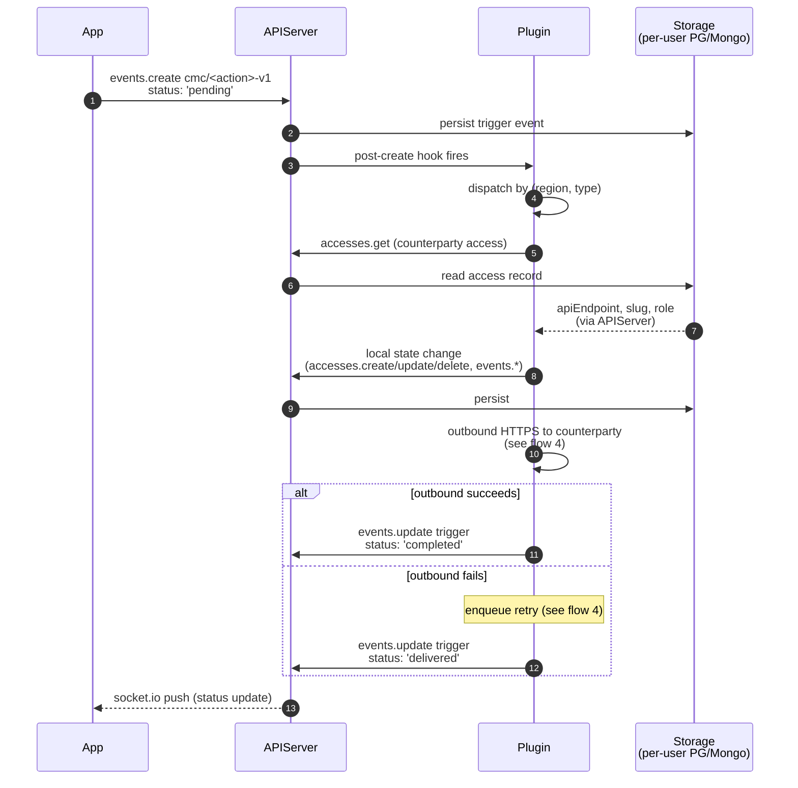
```mermaid
sequenceDiagram
    autonumber
    participant App
    participant APIServer
    participant Plugin
    participant Storage as Storage<br/>(per-user PG/Mongo)

    App->>APIServer: events.create cmc/<action>-v1<br/>status: 'pending'
    APIServer->>Storage: persist trigger event
    APIServer->>Plugin: post-create hook fires
    Plugin->>Plugin: dispatch by (region, type)
    Plugin->>APIServer: accesses.get (counterparty access)
    APIServer->>Storage: read access record
    Storage-->>Plugin: apiEndpoint, slug, role<br/>(via APIServer)
    Plugin->>APIServer: local state change<br/>(accesses.create/update/delete, events.*)
    APIServer->>Storage: persist
    Plugin->>Plugin: outbound HTTPS to counterparty<br/>(see flow 4)
    alt outbound succeeds
        Plugin->>APIServer: events.update trigger<br/>status: 'completed'
    else outbound fails
        Note over Plugin: enqueue retry (see flow 4)
        Plugin->>APIServer: events.update trigger<br/>status: 'delivered'
    end
    APIServer-->>App: socket.io push (status update)
```

**`status` lifecycle**:

```
'pending'    Plugin received the trigger; local state change not yet applied
'delivered'  Local change done + outbound enqueued/in-flight; awaiting counterparty ack
'completed'  Counterparty's plugin acknowledged; action fully done
'failed'     Terminal failure; content.failure has details
```

The Plugin and APIServer are typically the same process (workers). The split in the diagram is **logical** — the plugin's post-hook runs inside the same event-loop tick as the `events.create` that triggered it; outbound HTTPS is async / queue-driven.

---

# 2. Capability access mint + lifecycle

When `cmc/request-v1` is written with `capabilityRequested: true`, the plugin creates a `shared` access scoped to **exactly one event** (the request) via two **real per-capability streams** under the hidden `:_cmc:_internal:` parent:

- `:_cmc:_internal:offer:<capId>` — the plugin pre-populates with the one request event (read).
- `:_cmc:_internal:responses:<capId>` — empty at mint, accepts exactly one accept/refuse (create-only).

These are real streams, not virtual — per-event access scoping doesn't exist in core (see [audit notes](#audit-notes)). The plugin GCs both streams (and the access) together on first response or TTL expiry.

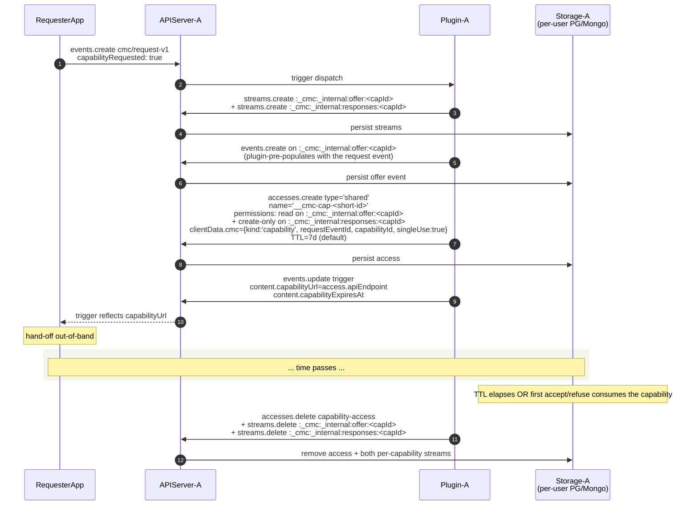
```mermaid
sequenceDiagram
    autonumber
    participant App as RequesterApp
    participant APIServer as APIServer-A
    participant Plugin as Plugin-A
    participant Storage as Storage-A<br/>(per-user PG/Mongo)

    App->>APIServer: events.create cmc/request-v1<br/>capabilityRequested: true
    APIServer->>Plugin: trigger dispatch
    Plugin->>APIServer: streams.create :_cmc:_internal:offer:<capId><br/>+ streams.create :_cmc:_internal:responses:<capId>
    APIServer->>Storage: persist streams
    Plugin->>APIServer: events.create on :_cmc:_internal:offer:<capId><br/>(plugin-pre-populates with the request event)
    APIServer->>Storage: persist offer event
    Plugin->>APIServer: accesses.create type='shared'<br/>name='__cmc-cap-<short-id>'<br/>permissions: read on :_cmc:_internal:offer:<capId><br/>+ create-only on :_cmc:_internal:responses:<capId><br/>clientData.cmc={kind:'capability', requestEventId, capabilityId, singleUse:true}<br/>TTL=7d (default)
    APIServer->>Storage: persist access
    Plugin->>APIServer: events.update trigger<br/>content.capabilityUrl=access.apiEndpoint<br/>content.capabilityExpiresAt
    APIServer-->>App: trigger reflects capabilityUrl
    Note over App: hand-off out-of-band

    rect rgb(245, 245, 235)
    Note over App,Storage: ... time passes ...
    end

    Note over Storage: TTL elapses OR first accept/refuse consumes the capability
    Plugin->>APIServer: accesses.delete capability-access<br/>+ streams.delete :_cmc:_internal:offer:<capId><br/>+ streams.delete :_cmc:_internal:responses:<capId>
    APIServer->>Storage: remove access + both per-capability streams
```

**Single-use enforcement under concurrency** (open question, tested via `[CMCRACE]`): two `cmc/accept-v1` arriving in parallel against the same capability — first-write-wins on `:_cmc:_internal:responses:<capId>`. The plugin enforces "exactly one event ever in this stream" via a write-hook that checks the stream's event count before persisting (queries via standard `events.get` with `limit: 1`). The losing accept rolls back its local data-grant access (atomic dual-write — see flow 3).

**Visibility:** capability accesses are filtered out of `accesses.get` by default via `clientData.cmc.kind: 'capability'`. Operator audit can opt-in via a query parameter (open question 5).

---

# 3. Acceptance — bidirectional access pair creation

The most intricate flow. The accepting user writes `cmc/accept-v1`; their plugin orchestrates with the requester's plugin to provision:

1. Data-grant access on the accepter's account (carrying the requester's identity in `clientData.cmc.counterparty`).
2. Back-channel access on the requester's account (carrying the accepter's data-grant apiEndpoint in `clientData.cmc.counterparty.apiEndpoint`).
3. Auto-created anchor streams under the app scope on **both** sides (so chat + system flows can start immediately):
   - `:_cmc:apps:<app-code>:[<path>:]chats:<counterparty-slug>`
   - `:_cmc:apps:<app-code>:[<path>:]collectors:<counterparty-slug>`

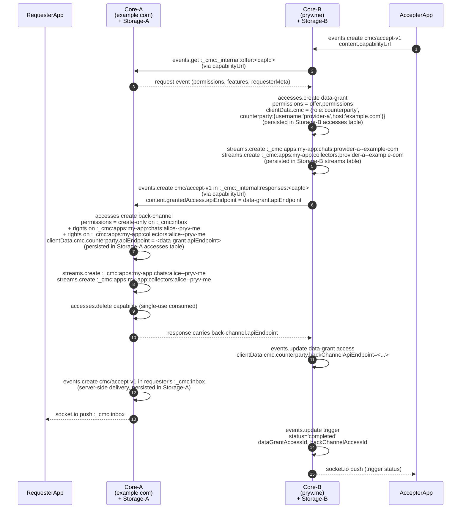
```mermaid
sequenceDiagram
    autonumber
    participant RequesterApp
    participant CoreA as Core-A<br/>(example.com)<br/>+ Storage-A
    participant CoreB as Core-B<br/>(pryv.me)<br/>+ Storage-B
    participant AccepterApp

    AccepterApp->>CoreB: events.create cmc/accept-v1<br/>content.capabilityUrl
    CoreB->>CoreA: events.get :_cmc:_internal:offer:<capId><br/>(via capabilityUrl)
    CoreA-->>CoreB: request event (permissions, features, requesterMeta)
    CoreB->>CoreB: accesses.create data-grant<br/>permissions = offer.permissions<br/>clientData.cmc = {role:'counterparty',<br/>counterparty:{username:'provider-a',host:'example.com'}}<br/>(persisted in Storage-B accesses table)
    CoreB->>CoreB: streams.create :_cmc:apps:my-app:chats:provider-a--example-com<br/>streams.create :_cmc:apps:my-app:collectors:provider-a--example-com<br/>(persisted in Storage-B streams table)
    CoreB->>CoreA: events.create cmc/accept-v1 in :_cmc:_internal:responses:<capId><br/>(via capabilityUrl)<br/>content.grantedAccess.apiEndpoint = data-grant.apiEndpoint
    CoreA->>CoreA: accesses.create back-channel<br/>permissions = create-only on :_cmc:inbox<br/>+ rights on :_cmc:apps:my-app:chats:alice--pryv-me<br/>+ rights on :_cmc:apps:my-app:collectors:alice--pryv-me<br/>clientData.cmc.counterparty.apiEndpoint = <data-grant apiEndpoint><br/>(persisted in Storage-A accesses table)
    CoreA->>CoreA: streams.create :_cmc:apps:my-app:chats:alice--pryv-me<br/>streams.create :_cmc:apps:my-app:collectors:alice--pryv-me
    CoreA->>CoreA: accesses.delete capability (single-use consumed)
    CoreA-->>CoreB: response carries back-channel.apiEndpoint
    CoreB->>CoreB: events.update data-grant access<br/>clientData.cmc.counterparty.backChannelApiEndpoint=<...>
    CoreA->>CoreA: events.create cmc/accept-v1 in requester's :_cmc:inbox<br/>(server-side delivery, persisted in Storage-A)
    CoreA-->>RequesterApp: socket.io push :_cmc:inbox
    CoreB->>CoreB: events.update trigger<br/>status='completed'<br/>dataGrantAccessId, backChannelAccessId
    CoreB-->>AccepterApp: socket.io push (trigger status)
```

All persistence happens in the **per-user accesses/streams/events tables** of each core's standard storage (PG/Mongo). No rqlite, no separate engine.

**Atomicity worry:** if step 9 (capability delete) crashes after the back-channel access is created (step 7) but before the response is sent (step 10), the accepter retries and the request fails with `capability-already-consumed`. Recovery: operator-side cleanup script (backlog) reads back-channel accesses created without a paired data-grant and prunes. v1 ships with the race surfaced as an error; pruning is operational.

**Anchor stream creation idempotence:** `streams.create` is upsert-semantics in the plugin (catches `stream-already-exists` and continues). Two simultaneous accepts from the same user against two different counterparties won't collide on the user's `:_cmc:apps:<app-code>:[<path>:]chats:` / `collectors:` parents.

---

# 4. Outbound delivery — HTTPS + retry queue (hidden companion stream)

Plugin's outbound calls to counterparty `apiEndpoint`s. All cross-platform / cross-core deliveries go through this path; same-core same-platform is short-circuited (see flow 12).

**Retry queue lives as events in a hidden companion stream.** No new storage primitive — the queue is just events in `:_cmc:_internal:retries`, persisted in the user's standard main storage. The plugin reads / writes via the same `events.*` API any app uses. The `:_cmc:_internal:*` prefix is filtered out of regular `events.get` responses by the plugin's read-hooks so app code can't see it.

Each pending delivery is one event:

```ts
{
  streamIds: [':_cmc:_internal:retries'],
  type: 'cmc/retry-v1',
  content: {
    apiEndpoint:    string,    // counterparty's stored apiEndpoint
    payload:        object,    // the body to POST
    attempts:       number,    // current attempt count
    nextAttemptAt:  number,    // unix timestamp (seconds)
    triggerEventId: string,    // back-pointer to the user-facing trigger
    failureReason:  string?    // last error if known
  }
}
```

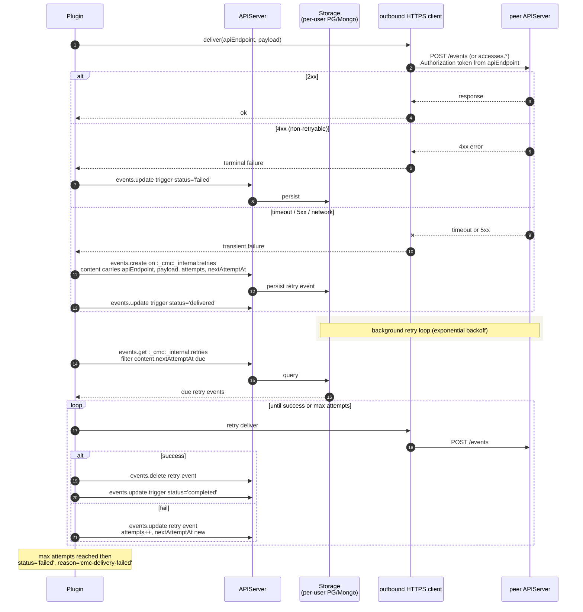
```mermaid
sequenceDiagram
    autonumber
    participant Plugin
    participant APIServer
    participant Storage as Storage<br/>(per-user PG/Mongo)
    participant HTTPSClient as outbound HTTPS client
    participant Peer as peer APIServer

    Plugin->>HTTPSClient: deliver(apiEndpoint, payload)
    HTTPSClient->>Peer: POST /events (or accesses.*)<br/>Authorization token from apiEndpoint
    alt 2xx
        Peer-->>HTTPSClient: response
        HTTPSClient-->>Plugin: ok
    else 4xx (non-retryable)
        Peer-->>HTTPSClient: 4xx error
        HTTPSClient-->>Plugin: terminal failure
        Plugin->>APIServer: events.update trigger status='failed'
        APIServer->>Storage: persist
    else timeout / 5xx / network
        Peer--xHTTPSClient: timeout or 5xx
        HTTPSClient-->>Plugin: transient failure
        Plugin->>APIServer: events.create on :_cmc:_internal:retries<br/>content carries apiEndpoint, payload, attempts, nextAttemptAt
        APIServer->>Storage: persist retry event
        Plugin->>APIServer: events.update trigger status='delivered'
    end

    rect rgb(245, 245, 235)
    Note over Storage,Peer: background retry loop (exponential backoff)
    end

    Plugin->>APIServer: events.get :_cmc:_internal:retries<br/>filter content.nextAttemptAt due
    APIServer->>Storage: query
    Storage-->>Plugin: due retry events
    loop until success or max attempts
        Plugin->>HTTPSClient: retry deliver
        HTTPSClient->>Peer: POST /events
        alt success
            Plugin->>APIServer: events.delete retry event
            Plugin->>APIServer: events.update trigger status='completed'
        else fail
            Plugin->>APIServer: events.update retry event<br/>attempts++, nextAttemptAt new
        end
    end
    Note over Plugin: max attempts reached then<br/>status='failed', reason='cmc-delivery-failed'
```

**Retry policy** (proposed, finalize in Phase B):
- Attempts: 1 immediate + N retries with exponential backoff (1m, 5m, 30m, 2h, 6h, 24h — total ~32h).
- Audit: every attempt logs (apiEndpoint host, payload type, attempt#, outcome) to the standard Pryv audit stream. Bodies redacted.
- Cross-cluster vs cross-platform: same code path; only the destination host differs.

**v1 limitation (acknowledged, not solved):** the retry queue lives with the user's data. If the user's home core dies, pending retries wait for the core to recover — same failure mode as every other piece of user state. Cross-core failover for users is a platform-wide problem outside CMC's scope.

**Concurrency:** two workers picking the same due retry — solved by `events.update` optimistic locking on the retry event (compare-and-swap on `content.attempts`). Standard Pryv semantics, no new primitive.

**Backpressure:** a saturated peer (sustained 503s from a foreign platform) shouldn't pin the whole retry loop. Per-host queue with hot/cold-host separation is a backlog optimization.

---

# 5. Inbox write-hook validation

`:_cmc:inbox` is plugin-internal-write-only. The plugin's `events.create` hook validates every inbox write before persisting. App tokens are rejected immediately; only counterparty-marked access tokens may write.

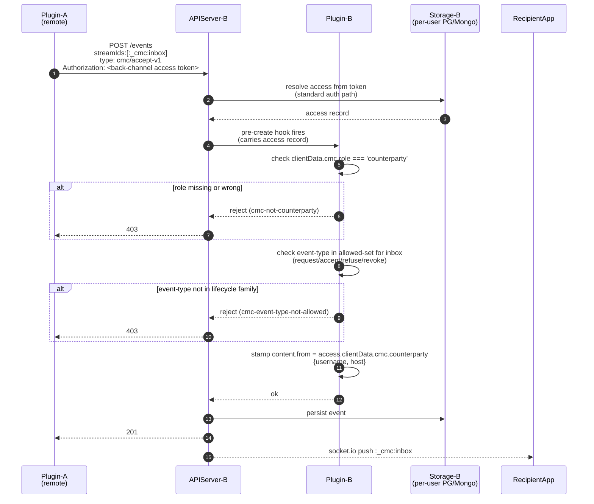
```mermaid
sequenceDiagram
    autonumber
    participant PeerPlugin as Plugin-A<br/>(remote)
    participant APIServer as APIServer-B
    participant Plugin as Plugin-B
    participant Storage as Storage-B<br/>(per-user PG/Mongo)
    participant App as RecipientApp

    PeerPlugin->>APIServer: POST /events<br/>streamIds:[:_cmc:inbox]<br/>type: cmc/accept-v1<br/>Authorization: <back-channel access token>
    APIServer->>Storage: resolve access from token<br/>(standard auth path)
    Storage-->>APIServer: access record
    APIServer->>Plugin: pre-create hook fires<br/>(carries access record)
    Plugin->>Plugin: check clientData.cmc.role === 'counterparty'
    alt role missing or wrong
        Plugin-->>APIServer: reject (cmc-not-counterparty)
        APIServer-->>PeerPlugin: 403
    end
    Plugin->>Plugin: check event-type in allowed-set for inbox<br/>(request/accept/refuse/revoke)
    alt event-type not in lifecycle family
        Plugin-->>APIServer: reject (cmc-event-type-not-allowed)
        APIServer-->>PeerPlugin: 403
    end
    Plugin->>Plugin: stamp content.from = access.clientData.cmc.counterparty<br/>{username, host}
    Plugin-->>APIServer: ok
    APIServer->>Storage: persist event
    APIServer-->>PeerPlugin: 201
    APIServer-->>App: socket.io push :_cmc:inbox
```

**`content.from` is unforgeable** — the peer plugin cannot set `content.from` themselves; even if they include it in the body, the receiving plugin overwrites with the access's stored counterparty identity. The access was created by the recipient's plugin at acceptance time (flow 3); its `clientData.cmc.counterparty` is server-internal and not visible to API consumers.

**Chat/collector write-hooks** are analogous but allow a different event-type set per region (Family 2 events on `:_cmc:chats:*`, Family 3 events on `:_cmc:collectors:*`).

---

# 6. Chat delivery — slug-driven access resolution

App writes `cmc/chat-v1` to `:_cmc:chats:<counterparty-slug>`. The slug encodes the counterparty; the plugin resolves the access pair from local state.

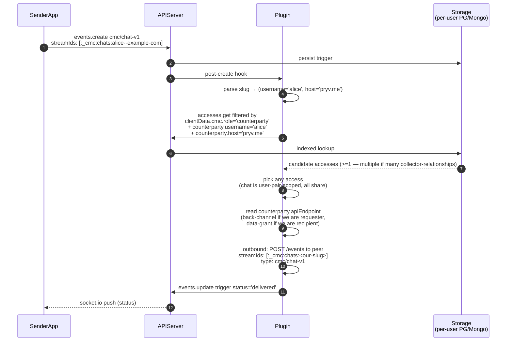
```mermaid
sequenceDiagram
    autonumber
    participant App as SenderApp
    participant APIServer
    participant Plugin
    participant Storage as Storage<br/>(per-user PG/Mongo)

    App->>APIServer: events.create cmc/chat-v1<br/>streamIds: [:_cmc:chats:alice--example-com]
    APIServer->>Storage: persist trigger
    APIServer->>Plugin: post-create hook
    Plugin->>Plugin: parse slug → (username='alice', host='pryv.me')
    Plugin->>APIServer: accesses.get filtered by<br/>clientData.cmc.role='counterparty'<br/>+ counterparty.username='alice'<br/>+ counterparty.host='pryv.me'
    APIServer->>Storage: indexed lookup
    Storage-->>Plugin: candidate accesses (>=1 — multiple if many collector-relationships)
    Plugin->>Plugin: pick any access<br/>(chat is user-pair-scoped, all share)
    Plugin->>Plugin: read counterparty.apiEndpoint<br/>(back-channel if we are requester,<br/>data-grant if we are recipient)
    Plugin->>Plugin: outbound: POST /events to peer<br/>streamIds: [:_cmc:chats:<our-slug>]<br/>type: cmc/chat-v1
    Plugin->>APIServer: events.update trigger status='delivered'
    APIServer-->>App: socket.io push (status)
```

**Index requirement:** Phase B `DATA-RESIDENCY.md` must specify a B-tree index on `accesses.clientData.cmc.counterparty.{username, host}` (PG path) / equivalent on Mongo. Without it, the slug-resolution lookup degrades to a full-table scan per chat write.

**Multiple-collectors-same-counterparty:** the plugin picks any pair; the receiving plugin resolves to the same `:_cmc:chats:<sender-slug>` stream regardless. This is why chat is "per user-pair, not per collector."

**Pre-acceptance edge case:** if the user types into `:_cmc:chats:<slug>` before the access pair exists (impossible if the plugin auto-creates streams at acceptance, but possible if the user manually `streams.create`s a chat stream), the trigger fails with `cmc-no-counterparty-access`.

---

# 7. System channel delivery — features gate + rate-limit

Same shape as chat, with an additional `features.systemMessaging` check and per-source per-recipient rate-limit.

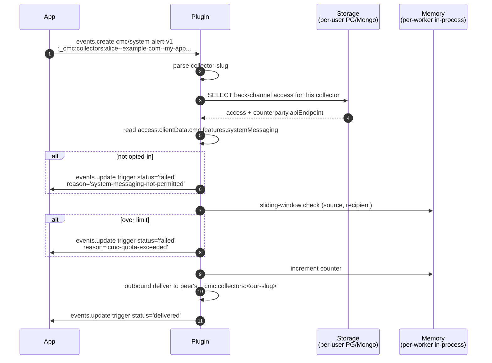
```mermaid
sequenceDiagram
    autonumber
    participant App
    participant Plugin
    participant Storage as Storage<br/>(per-user PG/Mongo)
    participant Memory as Memory<br/>(per-worker in-process)

    App->>Plugin: events.create cmc/system-alert-v1<br/>:_cmc:collectors:alice--example-com--my-app...
    Plugin->>Plugin: parse collector-slug
    Plugin->>Storage: SELECT back-channel access for this collector
    Storage-->>Plugin: access + counterparty.apiEndpoint
    Plugin->>Plugin: read access.clientData.cmc.features.systemMessaging
    alt not opted-in
        Plugin->>App: events.update trigger status='failed'<br/>reason='system-messaging-not-permitted'
    end
    Plugin->>Memory: sliding-window check (source, recipient)
    alt over limit
        Plugin->>App: events.update trigger status='failed'<br/>reason='cmc-quota-exceeded'
    end
    Plugin->>Memory: increment counter
    Plugin->>Plugin: outbound deliver to peer's :_cmc:collectors:<our-slug>
    Plugin->>App: events.update trigger status='delivered'
```

**Quota** (open question 4 in PLAN): 100 events/min per source per recipient proposed.

**Rate-limit storage = per-worker in-memory.** A circular buffer of timestamps per `(source, recipient)` tuple, scoped to one Node worker. Cheap, no I/O, lost on worker restart.

**Known v1 drift:** counters are not shared across workers on the same core. On an N-worker core, a recipient can briefly receive up to N× the configured limit. **Acceptable for v1** — the quota is defensive against abuse, not a strict guarantee. If drift becomes a real problem, `cluster_kv` (master-held in-process, same-core cross-worker — NOT a cross-core primitive) is the upgrade path. Cross-core drift is out of scope by the "no cross-core state in CMC" principle (README.md "Future development scoping").

**Critical-level allowance:** `cmc/system-alert-v1` with `level: 'critical'` may bypass the standard quota (higher tier). Open question 5 in PLAN — per-level vs all-or-nothing opt-in.

---

# 8. Scope-request orchestration (collector side, permission-chain pre-validation)

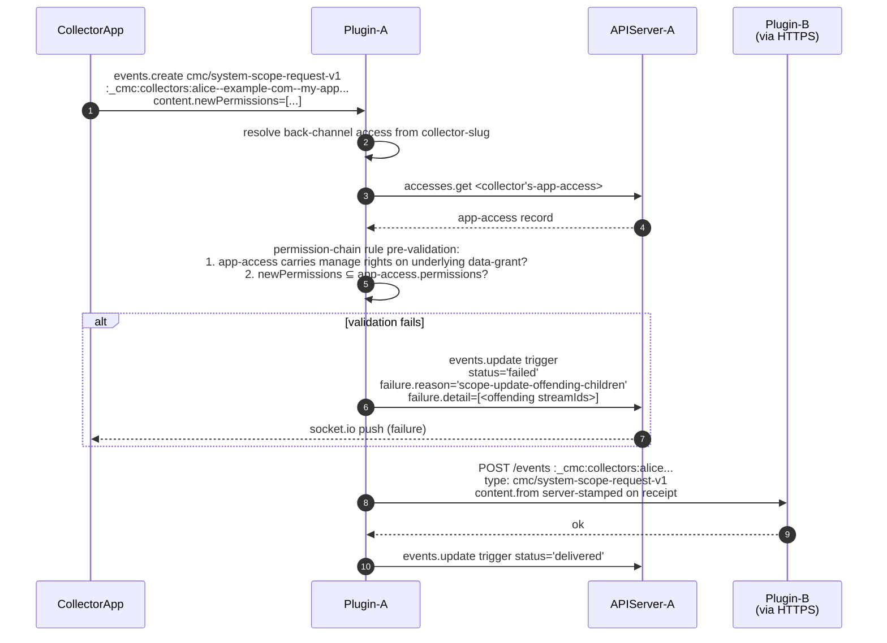
```mermaid
sequenceDiagram
    autonumber
    participant CollectorApp
    participant Plugin as Plugin-A
    participant APIServer as APIServer-A
    participant Peer as Plugin-B<br/>(via HTTPS)

    CollectorApp->>Plugin: events.create cmc/system-scope-request-v1<br/>:_cmc:collectors:alice--example-com--my-app...<br/>content.newPermissions=[...]
    Plugin->>Plugin: resolve back-channel access from collector-slug
    Plugin->>APIServer: accesses.get <collector's-app-access>
    APIServer-->>Plugin: app-access record
    Plugin->>Plugin: permission-chain rule pre-validation:<br/>1. app-access carries manage rights on underlying data-grant?<br/>2. newPermissions ⊆ app-access.permissions?
    alt validation fails
        Plugin->>APIServer: events.update trigger<br/>status='failed'<br/>failure.reason='scope-update-offending-children'<br/>failure.detail=[<offending streamIds>]
        APIServer-->>CollectorApp: socket.io push (failure)
    end
    Plugin->>Peer: POST /events :_cmc:collectors:alice...<br/>type: cmc/system-scope-request-v1<br/>content.from server-stamped on receipt
    Peer-->>Plugin: ok
    Plugin->>APIServer: events.update trigger status='delivered'
```

**Why pre-validate on the collector side:** invalid scope requests are caught before bothering the user. The user's plugin re-validates on receipt as defense-in-depth, but the common case is the collector's app catches its own mistakes.

---

# 9. Scope-update — user accepts; `accesses.update`

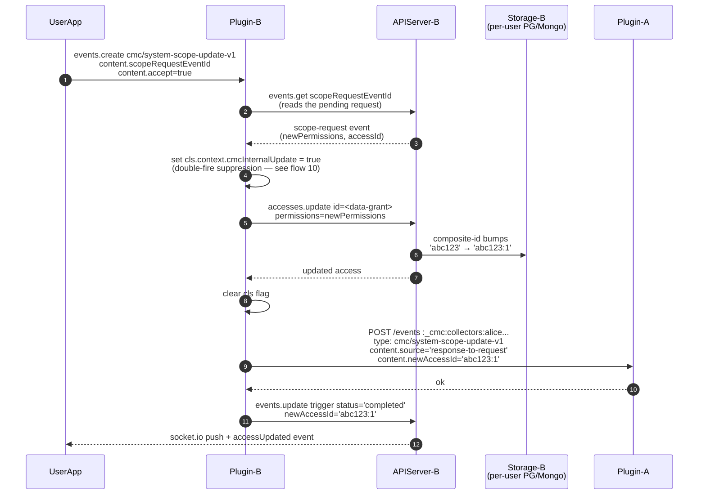
```mermaid
sequenceDiagram
    autonumber
    participant UserApp
    participant Plugin as Plugin-B
    participant APIServer as APIServer-B
    participant Storage as Storage-B<br/>(per-user PG/Mongo)
    participant Peer as Plugin-A

    UserApp->>Plugin: events.create cmc/system-scope-update-v1<br/>content.scopeRequestEventId<br/>content.accept=true
    Plugin->>APIServer: events.get scopeRequestEventId<br/>(reads the pending request)
    APIServer-->>Plugin: scope-request event<br/>(newPermissions, accessId)
    Plugin->>Plugin: set cls.context.cmcInternalUpdate = true<br/>(double-fire suppression — see flow 10)
    Plugin->>APIServer: accesses.update id=<data-grant><br/>permissions=newPermissions
    APIServer->>Storage: composite-id bumps<br/>'abc123' → 'abc123:1'
    APIServer-->>Plugin: updated access
    Plugin->>Plugin: clear cls flag
    Plugin->>Peer: POST /events :_cmc:collectors:alice...<br/>type: cmc/system-scope-update-v1<br/>content.source='response-to-request'<br/>content.newAccessId='abc123:1'
    Peer-->>Plugin: ok
    Plugin->>APIServer: events.update trigger status='completed'<br/>newAccessId='abc123:1'
    APIServer-->>UserApp: socket.io push + accessUpdated event
```

**Refusal path** (`accept: false`): plugin skips steps 4–7 entirely; delivers a `cmc/system-scope-update-v1` with `content.accept=false` and `refusalDetails` set. No local `accesses.update` runs → no post-hook fire → no double-notification.

---

# 10. `accesses.update` post-hook + double-fire suppression

The post-hook fires on every successful `accesses.update`. It detects counterparty accesses and auto-notifies. Double-fire suppression prevents a redundant notification when the CMC trigger handler (flow 9) is the caller.

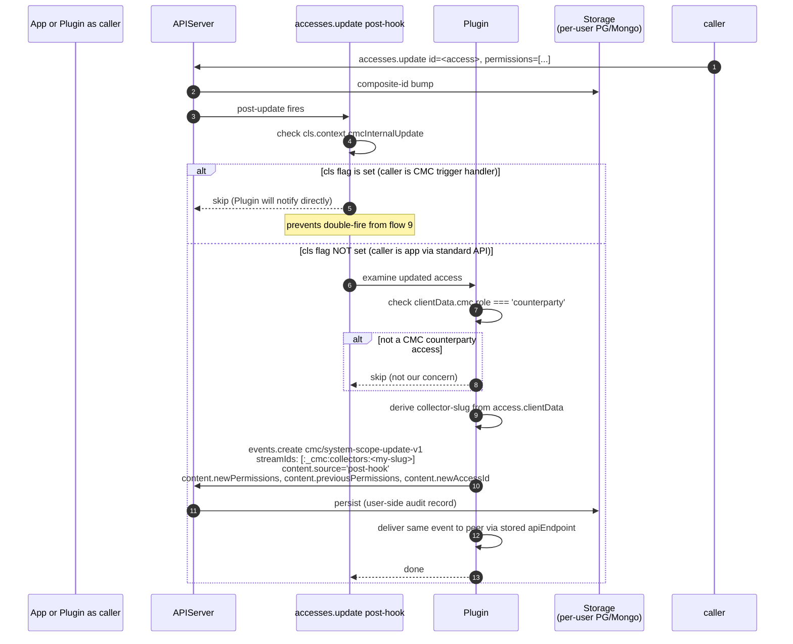
```mermaid
sequenceDiagram
    autonumber
    participant App or Plugin as caller
    participant APIServer
    participant PostHook as accesses.update post-hook
    participant Plugin
    participant Storage as Storage<br/>(per-user PG/Mongo)

    caller->>APIServer: accesses.update id=<access>, permissions=[...]
    APIServer->>Storage: composite-id bump
    APIServer->>PostHook: post-update fires
    PostHook->>PostHook: check cls.context.cmcInternalUpdate
    alt cls flag is set (caller is CMC trigger handler)
        PostHook-->>APIServer: skip (Plugin will notify directly)
        Note over PostHook: prevents double-fire from flow 9
    else cls flag NOT set (caller is app via standard API)
        PostHook->>Plugin: examine updated access
        Plugin->>Plugin: check clientData.cmc.role === 'counterparty'
        alt not a CMC counterparty access
            Plugin-->>PostHook: skip (not our concern)
        end
        Plugin->>Plugin: derive collector-slug from access.clientData
        Plugin->>APIServer: events.create cmc/system-scope-update-v1<br/>streamIds: [:_cmc:collectors:<my-slug>]<br/>content.source='post-hook'<br/>content.newPermissions, content.previousPermissions, content.newAccessId
        APIServer->>Storage: persist (user-side audit record)
        Plugin->>Plugin: deliver same event to peer via stored apiEndpoint
        Plugin-->>PostHook: done
    end
```

**Double-fire suppression mechanism** (open question 8): proposed using `cls-hooked` continuation-local storage. The trigger handler (flow 9 step 3) sets a flag before calling `accesses.update`; the post-hook reads it; the flag clears at end-of-request. This is the cleanest because it doesn't change `accesses.update`'s API surface and survives async boundaries within the same logical request.

**Failure cases:**
- App calls `accesses.update` against a non-counterparty access → post-hook detects `role !== 'counterparty'` and skips. No-op (correct).
- App calls `accesses.update` against a counterparty access while a CMC trigger is mid-flight → cls is request-scoped, so the two paths don't see each other's flags. The post-hook fires once for the app's call; the trigger handler delivers its own notification for the CMC call. Two notifications for two distinct user actions — correct.
- Concurrent app + CMC updates against the same access → composite-id ensures only one wins; the loser sees `stale-access-id` and retries. The retry path reads fresh permissions and either: skips (already at desired state) or fires the post-hook (legitimate second change).

---

# 11. Slug computation

Deterministic. Helpers ship in `lib-js` / `legacy-shim`. The plugin uses the same code for stream-id construction so client + server agree.

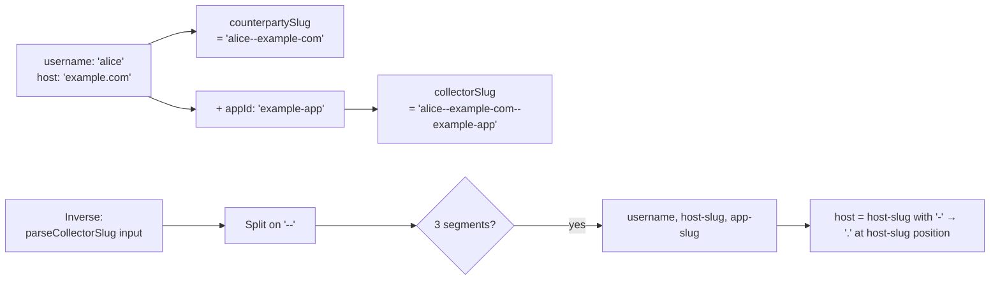
```mermaid
flowchart LR
    A[username: 'alice'<br/>host: 'example.com']
    A --> B[counterpartySlug<br/>= 'alice--example-com']
    A --> C[+ appId: 'example-app']
    C --> D[collectorSlug<br/>= 'alice--example-com--example-app']

    E[Inverse:<br/>parseCollectorSlug input]
    E --> F[Split on '--']
    F --> G{3 segments?}
    G -- yes --> H[username, host-slug, app-slug]
    H --> I[host = host-slug with '-' → '.' at host-slug position]
```

**Edge cases to enforce (Phase B):**
- Username containing `--` is rejected at registration time (the user-validation rule extension).
- Host components containing `--` is impossible (DNS doesn't allow consecutive hyphens in labels).
- `appId` containing `--` is allowed but the slugifier replaces `--` with `-` before joining (`my--app` → `my-app--... ` else `parseCollectorSlug` would mis-split).
- Slugs are stable for the lifetime of the relationship (see IMPLEMENTERS-GUIDE.md "Stability" section).

---

# 12. Same-platform same-core in-process short-circuit

When the plugin's outbound apiEndpoint resolves to a local user on the same core, skip HTTPS entirely and dispatch directly into the local API server.

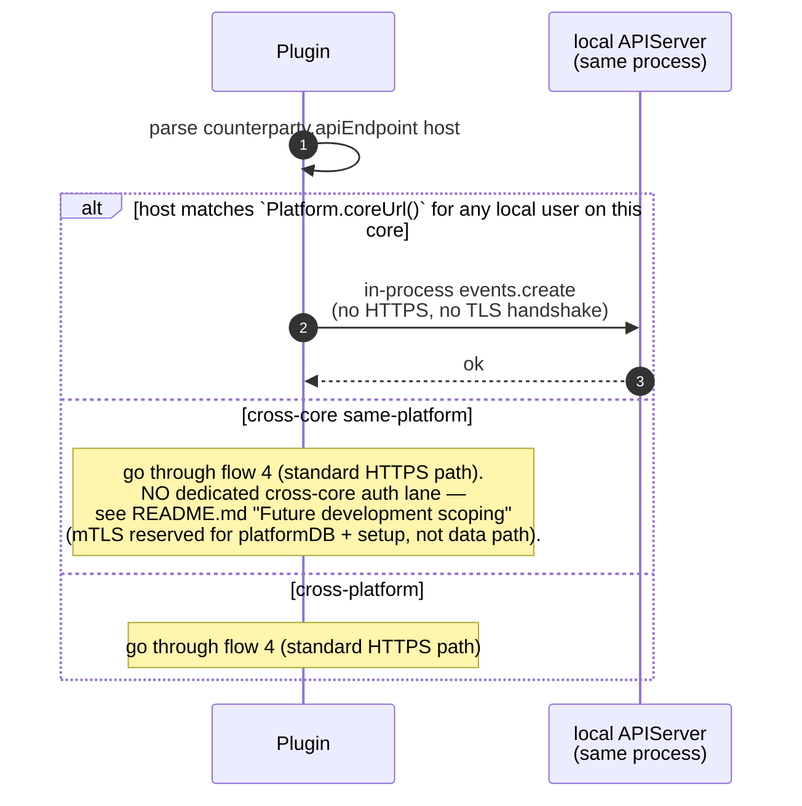
```mermaid
sequenceDiagram
    autonumber
    participant Plugin
    participant LocalAPI as local APIServer<br/>(same process)

    Plugin->>Plugin: parse counterparty.apiEndpoint host
    alt host matches `Platform.coreUrl()` for any local user on this core
        Plugin->>LocalAPI: in-process events.create<br/>(no HTTPS, no TLS handshake)
        LocalAPI-->>Plugin: ok
    else cross-core same-platform
        Note over Plugin: go through flow 4 (standard HTTPS path).<br/>NO dedicated cross-core auth lane —<br/>see README.md "Future development scoping"<br/>(mTLS reserved for platformDB + setup, not data path).
    else cross-platform
        Note over Plugin: go through flow 4 (standard HTTPS path)
    end
```

**Cross-core deliveries take the standard HTTPS path**, same as cross-platform. The access token in the apiEndpoint is the auth. We deliberately do NOT short-circuit cross-core via cluster-CA mTLS on `/events` — see README.md "Future development scoping" for the rationale.

---

# 13. Revoke teardown — dual `accesses.delete`

Either party writes `cmc/revoke-v1`. Their plugin deletes their local access and instructs the peer to delete its half. The anchor streams (`:_cmc:chats:`, `:_cmc:collectors:`) are **left in place** so history is preserved; future re-engagement starts a fresh request → accept cycle and the existing streams get reused.

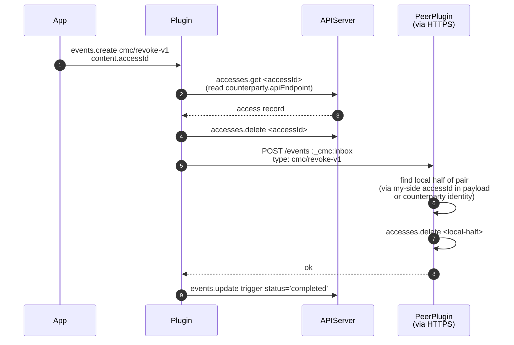
```mermaid
sequenceDiagram
    autonumber
    participant App
    participant Plugin
    participant APIServer
    participant Peer as PeerPlugin<br/>(via HTTPS)

    App->>Plugin: events.create cmc/revoke-v1<br/>content.accessId
    Plugin->>APIServer: accesses.get <accessId><br/>(read counterparty.apiEndpoint)
    APIServer-->>Plugin: access record
    Plugin->>APIServer: accesses.delete <accessId>
    Plugin->>Peer: POST /events :_cmc:inbox<br/>type: cmc/revoke-v1
    Peer->>Peer: find local half of pair<br/>(via my-side accessId in payload<br/>or counterparty identity)
    Peer->>Peer: accesses.delete <local-half>
    Peer-->>Plugin: ok
    Plugin->>APIServer: events.update trigger status='completed'
```

**Anchor stream history preservation:** chat + collector streams are NOT deleted on revoke. They become orphan-but-readable; the user can still scroll history. If the two parties later re-accept, the plugin re-creates the access pair pointing at the existing streams. (Re-acceptance edge case is tested in `[CMCREVOKE]`.)

**Failure asymmetry:** if step 5 fails terminally (peer down for >32h), the local access is already deleted. The peer's half lingers until the retry queue gives up; at that point, the peer's plugin logs an audit entry but doesn't `accesses.delete` autonomously (because it has no signed instruction from us). Recovery: peer's operator runs the same cleanup script as flow 3's atomicity case (backlog tooling).

---

# 14. Cross-platform e2e (Phase J validation)

Full end-to-end across two independent open-pryv.io platforms with different operators. This is the scenario that proves federation works without shared CA or shared user namespace.

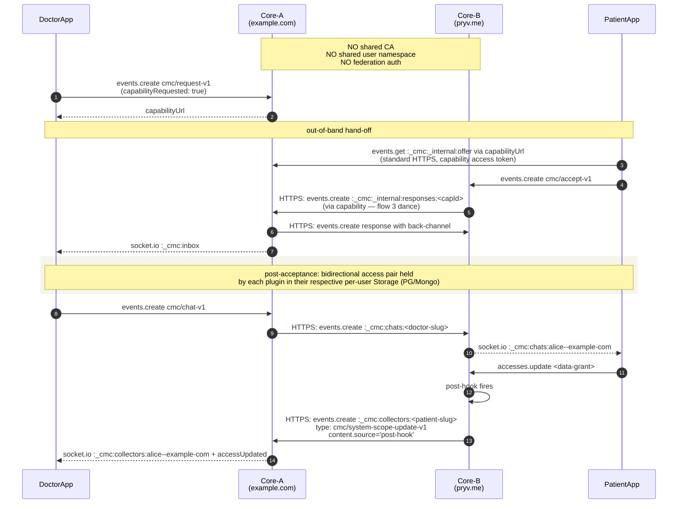
```mermaid
sequenceDiagram
    autonumber
    participant DApp as DoctorApp
    participant DCore as Core-A<br/>(example.com)
    participant PCore as Core-B<br/>(pryv.me)
    participant PApp as PatientApp

    Note over DCore,PCore: NO shared CA<br/>NO shared user namespace<br/>NO federation auth
    DApp->>DCore: events.create cmc/request-v1<br/>(capabilityRequested: true)
    DCore-->>DApp: capabilityUrl
    Note over DApp,PApp: out-of-band hand-off
    PApp->>DCore: events.get :_cmc:_internal:offer via capabilityUrl<br/>(standard HTTPS, capability access token)
    PApp->>PCore: events.create cmc/accept-v1
    PCore->>DCore: HTTPS: events.create :_cmc:_internal:responses:<capId><br/>(via capability — flow 3 dance)
    DCore->>PCore: HTTPS: events.create response with back-channel
    DCore-->>DApp: socket.io :_cmc:inbox

    rect rgb(245, 245, 235)
    Note over DApp,PApp: post-acceptance: bidirectional access pair held<br/>by each plugin in their respective per-user Storage (PG/Mongo)
    end

    DApp->>DCore: events.create cmc/chat-v1
    DCore->>PCore: HTTPS: events.create :_cmc:chats:<doctor-slug>
    PCore-->>PApp: socket.io :_cmc:chats:alice--example-com

    PApp->>PCore: accesses.update <data-grant>
    PCore->>PCore: post-hook fires
    PCore->>DCore: HTTPS: events.create :_cmc:collectors:<patient-slug><br/>type: cmc/system-scope-update-v1<br/>content.source='post-hook'
    DCore-->>DApp: socket.io :_cmc:collectors:alice--example-com + accessUpdated
```

**TLS:** each plugin's outbound HTTPS uses standard public-CA-validated TLS to the peer's domain. No mTLS, no shared cluster CA. The access token in the `apiEndpoint` URL is the auth.

**Topology invariance:** works for `dnsLess: true` on either side, mixed topologies, etc. — because all addressing is through `apiEndpoint` URLs, which the receiving platform serves at its own DNS / port.

---

# Notes for Phase B specs

Each numbered flow above corresponds to a specification document that needs writing before Phase C coding starts. The mapping:

| Flow # | Title | Spec doc |
|---|---|---|
| 1 | Trigger dispatch loop | `PLUGIN-INTERFACE.md` (write-hook contract; **CMC is plugin, not storage engine**) |
| 2 | Capability access lifecycle | `CAPABILITY-ACCESSES.md` |
| 3 | Bidirectional access pair | `COUNTERPARTY-ACCESSES.md` |
| 4 | Outbound HTTP + retry queue | `FEDERATION.md` + `DATA-RESIDENCY.md` (hidden companion stream + retry event schema) |
| 5 | Inbox write-hook | `COUNTERPARTY-ACCESSES.md` (write-hook section) |
| 6 | Chat slug-resolution | `EVENT-SCHEMAS.md` (per-family routing) + `DATA-RESIDENCY.md` (counterparty index requirement) |
| 7 | System channel + features + rate-limit | `EVENT-SCHEMAS.md` + `SECURITY-NOTES.md` + `DATA-RESIDENCY.md` (per-worker drift caveat) |
| 8 | Scope-request pre-validation | `EVENT-SCHEMAS.md` (permission-chain rules) |
| 9 | Scope-update with `accesses.update` | `EVENT-SCHEMAS.md` |
| 10 | Post-hook + suppression | `EVENT-SCHEMAS.md` + `OPEN-QUESTIONS.md` (cls-hooked mechanism choice) |
| 11 | Slug computation | `EVENT-SCHEMAS.md` (slug section) |
| 12 | Same-core short-circuit | `FEDERATION.md` (delivery-path matrix) |
| 13 | Revoke teardown | `EVENT-SCHEMAS.md` |
| 14 | Cross-platform e2e | `FEDERATION.md` |

Open questions deliberately left for Phase B (not blockers for this doc):

- Capability TTL default + override policy.
- Per-host queue / backpressure in retry loop.
- Operator audit visibility of capability accesses + the hidden `:_cmc:_internal:retries` stream.
- Anchor stream removal policy on revoke (currently: never; alternative: TTL-based archive).
- Quota numbers + critical-level allowance shape.
- Outbound egress operator policy (open vs allow-list).

---

# Out-of-scope flows (for completeness — not in v1)

- **future federated invite-webhook**: cross-platform directed invite auto-routing. CMC v1 falls back to capability-URL hand-off for cross-platform directed.
- **E2E encryption** of chat / system payloads. Plugin terminates TLS but content lives in plaintext on both platforms' per-user storage. Backlog.
- **Group / many-to-many** broadcast. Apps fan out N individual triggers.
- **Cross-scope state projection** (`:_cmc:state` summary across all `:_cmc:apps:*` + `:_cmc:chats` + `:_cmc:collectors`). v2.
- **Username / host migration**: would require slug-rename atomic transaction. Out of v1.
