# CMC plugin: Internal Flows (full plugin-side diagrams)

> **Audience:** plugin engineering, security review. **Not customer-facing**, for the API-consumer view see [IMPLEMENTERS-GUIDE.md](IMPLEMENTERS-GUIDE.md).
>
> This document expands each flow with plugin internals (orchestration loop, outbound HTTP, retry queue, post-hook double-fire suppression, slug-resolution, anchor stream auto-creation, etc.), the things the GUIDE deliberately keeps abstract.

## Data residency assumed in these diagrams

**Locked design:** CMC is a plugin (stream-id-namespace owner + orchestration hooks) running inside the API server process, NOT a separate storage engine. All `:_cmc:*` events, accesses, and streams live in the **standard per-user main storage (PG / SQLite)** alongside the user's other data, addressed through the normal `events.*` / `accesses.*` / `streams.*` API paths. The plugin doesn't bypass the API server to talk to storage; it dispatches through the same code paths app developers use.

**CMC introduces zero new storage primitives.** Internal plugin state, the outbound-delivery retry queue (flow 4), lives as events in a **hidden companion stream `:_cmc:_internal:retries`** inside main storage. **rqlite / platformDB / cluster-state primitives are NOT in CMC's design surface at all**, same discipline as the mTLS scoping principle in [README.md](README.md) "Future development scoping."

## Conventions

- `App` = customer code on either side (`DoctorApp`, `PatientApp`, etc.).
- `Core-X` = the open-pryv.io master process running the API server + the CMC plugin write-hooks. Where the boundary matters (post-hook, retry-queue), the diagrams split it into `APIServer-X` and `Plugin-X`.
- `Storage-X` = the **per-user PG / SQLite** instance for that core. Holds standard events, accesses, streams, including the user-visible `:_cmc:*` streams AND the hidden `:_cmc:_internal:*` plugin-state stream(s).
- HTTPS arrows crossing the `Plugin-X` ↔ `APIServer-Y` boundary are outbound deliveries (`/events` calls, `accesses.*` calls, etc.) authenticated by the access token embedded in the counterparty's stored `apiEndpoint`.

---

# 1. Plugin trigger dispatch loop (skeleton)

The plugin watches every `cmc/*` event write that lands on a stream under `:_cmc:`. Dispatch is by `(stream-region, event-type)`:

| Region | Event-type prefix the plugin handles |
|---|---|
| `:_cmc:inbox` | `consent/request-cmc`, `consent/revoke-cmc`, `consent/back-channel-cmc` delivered by a peer (one-shot lifecycle), and the server's copy of each `consent/accept-cmc` (an accept and a refuse themselves arrive on the capability's responses stream) |
| `:_cmc:apps:<app>:[<path>:]chats:<slug>` | `message/chat-cmc` |
| `:_cmc:apps:<app>:[<path>:]collectors:<slug>` | `notification/alert-cmc`, `notification/ack-cmc`, `consent/scope-request-cmc`, `consent/scope-update-cmc` |
| `:_cmc:_internal:retries` | `cmc-internal/retry-cmc` (plugin-managed; loop consumer) |

**Why nest under `:_cmc:apps:<app-code>:[<path>:]`**: an app's access can be scoped to all of its data (`:_cmc:apps:<app-code>:*`) or more granularly to a single per-request sub-tree (`:_cmc:apps:<app-code>:<request-slug>:*`). Chats / collectors lifetime under whichever stream the trigger event was written to is a natural permission prefix-match.

The trigger event's `content.status` is the visible state-machine. Apps subscribe to the trigger's home stream to see status updates land.

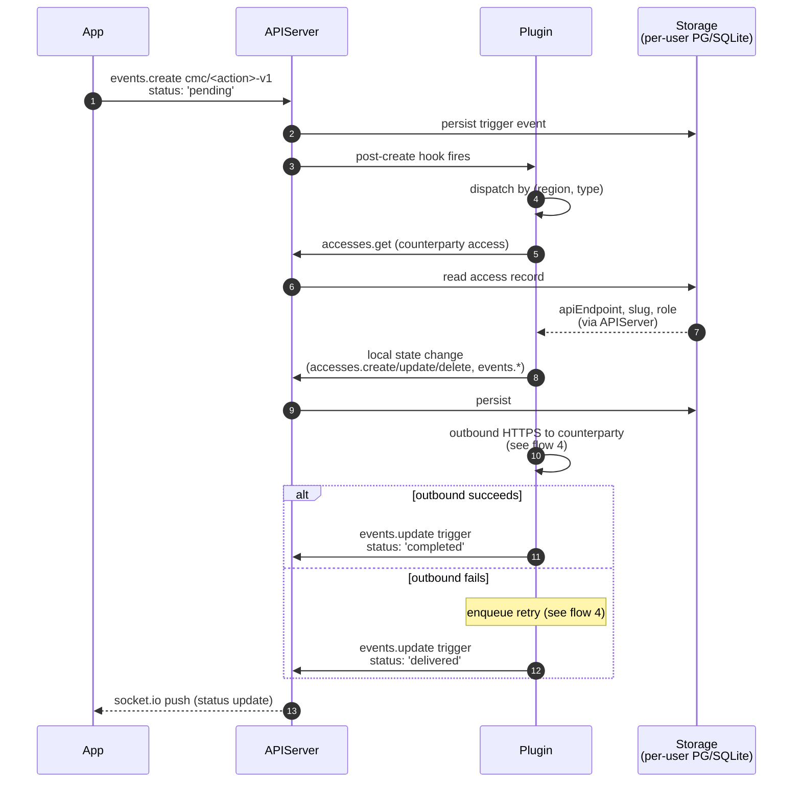

**`status` lifecycle**:

```
'pending'    Plugin received the trigger; local state change not yet applied
'delivered'  Local change done + outbound enqueued/in-flight; awaiting counterparty ack
'completed'  Counterparty's plugin acknowledged; action fully done
'failed'     Terminal failure; content.failure has details
```

The Plugin and APIServer are typically the same process (workers). The split in the diagram is **logical**, the plugin's post-hook runs inside the same event-loop tick as the `events.create` that triggered it; outbound HTTPS is async / queue-driven.

---

# 2. Capability access mint + lifecycle

When `consent/request-cmc` is written with `capabilityRequested: true`, the plugin creates a `shared` access scoped to **exactly one event** (the request) via two **real per-capability streams** under the hidden `:_cmc:_internal:` parent:

- `:_cmc:_internal:offer:<capId>`: the plugin pre-populates with the one request event (read).
- `:_cmc:_internal:responses:<capId>`: empty at mint, accepts exactly one accept/refuse (create-only).

These are real streams, not virtual, per-event access scoping doesn't exist in core (see [audit notes](#audit-notes)). The plugin keeps the access and both streams (state is tracked on the access; nothing is garbage-collected automatically, see the README, Capability accesses, Retention).

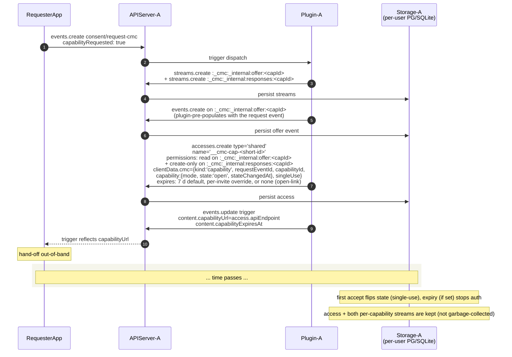

**Single-use enforcement under concurrency:** two `consent/accept-cmc` arriving in parallel against the same capability, first-write-wins on `:_cmc:_internal:responses:<capId>`. The plugin enforces "exactly one event ever in this stream" via a write-hook that checks the stream's event count before persisting (queries via standard `events.get` with `limit: 1`). The losing accept rolls back its local data-grant access (atomic dual-write, see flow 3).

**Visibility:** capability accesses are filtered out of `accesses.get` by default via `clientData.cmc.kind: 'capability'`. Operator audit can opt-in via a query parameter (open question 5).

---

# 3. Acceptance: bidirectional access pair creation

The most intricate flow. The accepting user writes `consent/accept-cmc`; their plugin orchestrates with the requester's plugin to provision:

1. Data-grant access on the accepter's account (carrying the requester's identity in `clientData.cmc.counterparty`).
2. Back-channel access on the requester's account (carrying the accepter's data-grant apiEndpoint in `clientData.cmc.counterparty.apiEndpoint`).
3. Auto-created anchor streams under the app scope on **both** sides (so chat + system flows can start immediately):
   - `:_cmc:apps:<app-code>:[<path>:]chats:<counterparty-slug>`, only when the resolved `features.chat` is true
   - `:_cmc:apps:<app-code>:[<path>:]collectors:<counterparty-slug>`

The relationship's features are resolved by each side from its own copy of the offer (`content.request.features`, each one true unless set to `false`), narrowed by the accept's `content.features` (a `true` there never turns on what the offer turned off): `features.ts`. Chat anchors and the chat permission (on the data grant and on the back-channel) exist only when the resolved `features.chat` is true; the `chats` parent is always created. The resolved pair is stamped on both accesses, the delivered accept, the accept trigger at completion and the inbox mirror. The requester finds its offer copy by a key the peer does not control first: an accept made through a capability sits in `:_cmc:_internal:responses:<capId>`, and the copy is the request in `:_cmc:_internal:offer:<capId>`. Only then, for an accept that did not come through a capability, by the `originalEventId` (else `requestEventId`) the accept names. An accept posted on `:_cmc:inbox` (even with the back-channel token a peer holds) is refused by the inbox hook; an accept on a responses stream whose offer copy is gone has no server-controlled key, so it can only narrow a relationship this side already holds for the scope: its features are ANDed with that access's recorded `features`. Only for a new relationship with no readable copy does the delivered value decide, logged at warn. Without chat the back-channel delivery leaves `remoteChatStreamId` out and the back-channel's `counterparty.remoteChatStreamId` is null.

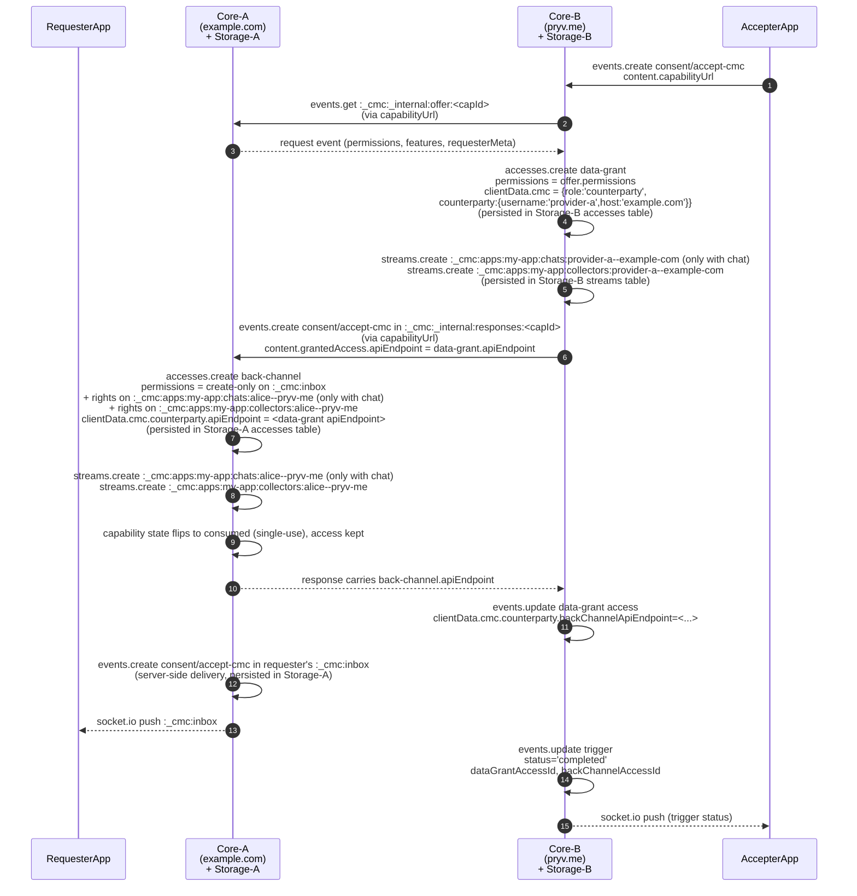

All persistence happens in the **per-user accesses/streams/events tables** of each core's standard storage (PG/SQLite). No rqlite, no separate engine.

**Atomicity worry:** if the single-use state flip to `consumed` happens after the back-channel access is created but the response is lost before it reaches the accepter, a retry through the same URL fails with `cmc-capability-consumed`. The capability access is not deleted (its state answers the retry). Recovery: operator-side cleanup script (backlog) reads back-channel accesses created without a paired data-grant and prunes. The race is surfaced as an error; pruning is operational.

**Anchor stream creation idempotence:** `streams.create` is upsert-semantics in the plugin (catches `stream-already-exists` and continues). Two simultaneous accepts from the same user against two different counterparties won't collide on the user's `:_cmc:apps:<app-code>:[<path>:]chats:` / `collectors:` parents.

---

# 4. Outbound delivery: HTTPS + retry queue (hidden companion stream)

Plugin's outbound calls to counterparty `apiEndpoint`s. All cross-platform / cross-core deliveries go through this path; same-core same-platform is short-circuited (see flow 12).

**Retry queue lives as events in a hidden companion stream.** No new storage primitive, the queue is just events in `:_cmc:_internal:retries`, persisted in the user's standard main storage. The plugin reads / writes via the same `events.*` API any app uses. The `:_cmc:_internal:*` prefix is filtered out of regular `events.get` responses by the plugin's read-hooks so app code can't see it.

Each pending delivery is one event:

```ts
{
  streamIds: [':_cmc:_internal:retries'],
  type: 'cmc-internal/retry-cmc',
  content: {
    apiEndpoint:    string,    // counterparty's stored apiEndpoint
    payload:        object,    // the body to POST
    attempts:       number,    // current attempt count
    nextAttemptAt:  number,    // unix timestamp (seconds)
    triggerEventId: string,    // back-pointer to the user-facing trigger
    failureReason:  string?    // last error if known
  }
}
```

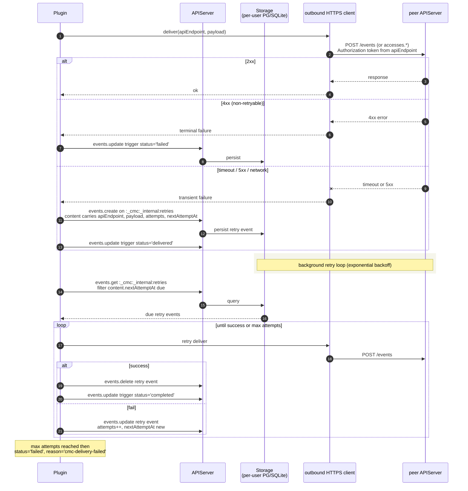

**Retry policy** (proposed):
- Attempts: 1 immediate + N retries with exponential backoff (1m, 5m, 30m, 2h, 6h, 24h, total ~32h).
- Audit: every attempt logs (apiEndpoint host, payload type, attempt#, outcome) to the standard Pryv audit stream. Bodies redacted.
- Cross-cluster vs cross-platform: same code path; only the destination host differs.

**v1 limitation (acknowledged, not solved):** the retry queue lives with the user's data. If the user's home core dies, pending retries wait for the core to recover, same failure mode as every other piece of user state. Cross-core failover for users is a platform-wide problem outside CMC's scope.

**Concurrency:** two workers picking the same due retry, solved by `events.update` optimistic locking on the retry event (compare-and-swap on `content.attempts`). Standard Pryv semantics, no new primitive.

**Backpressure:** a saturated peer (sustained 503s from a foreign platform) shouldn't pin the whole retry loop. Per-host queue with hot/cold-host separation is a backlog optimization.

---

# 5. Inbox write-hook validation

`:_cmc:inbox` is plugin-internal-write-only. The plugin's `events.create` hook validates every inbox write before persisting. App tokens are rejected immediately; only counterparty-marked access tokens may write.

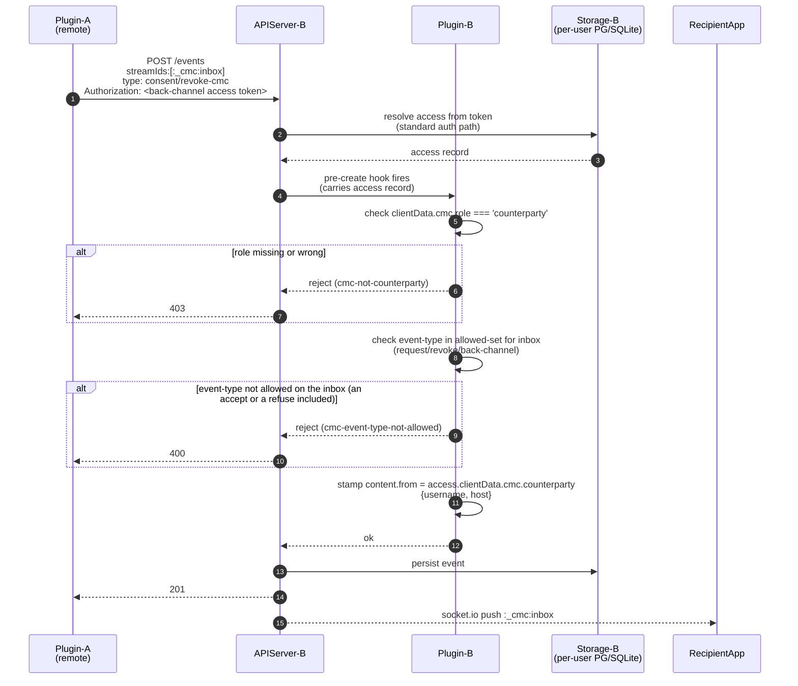

**`content.from` is unforgeable**: the peer plugin cannot set `content.from` themselves; even if they include it in the body, the receiving plugin overwrites with the access's stored counterparty identity. The access was created by the recipient's plugin at acceptance time (flow 3); its `clientData.cmc.counterparty` is server-internal and not visible to API consumers.

**Chat/collector write-hooks** are analogous but allow a different event-type set per region (Family 2 events on `:_cmc:apps:<app-code>:[<path>:]chats:*`, Family 3 events on `:_cmc:apps:<app-code>:[<path>:]collectors:*`). The `content.from` unforgeability extends to these paths too: `createCounterpartyFromStampingHook` overwrites `content.from` from the writer's `clientData.cmc.counterparty` for any chat / system event type when the access is counterparty-marked. Inbox writes stay handled by `createInboxWriteHook` (it has stricter rejection semantics on missing identity); the per-app stamping hook covers everything else.

---

# 6. Chat delivery: slug-driven access resolution

App writes `message/chat-cmc` to `:_cmc:apps:<app-code>:[<path>:]chats:<counterparty-slug>`. The trigger stream-id encodes the app scope + counterparty; the plugin resolves the access pair from local state.

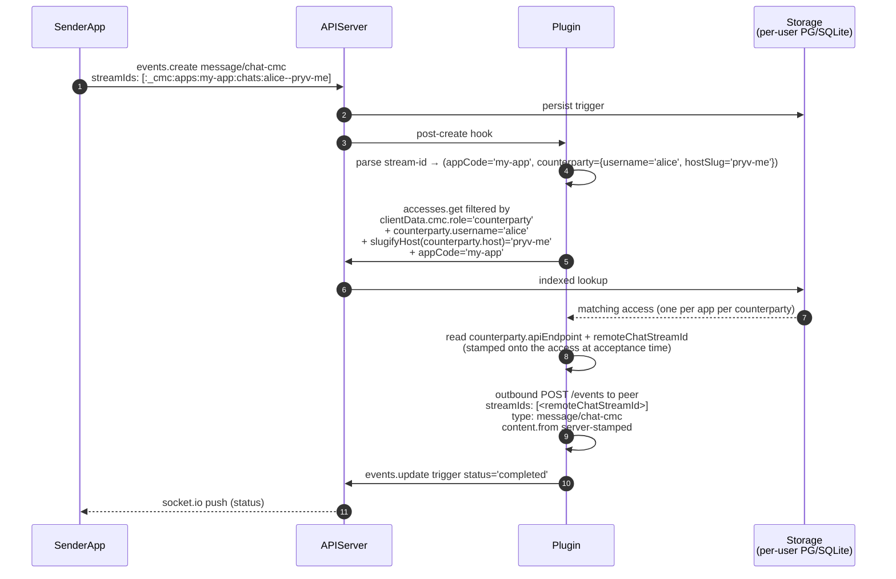

**Index requirement:** a B-tree index is required on `accesses.clientData.cmc.counterparty.{username, host}` (PG path) / equivalent on SQLite. Without it, the slug-resolution lookup degrades to a full-table scan per chat write.

**Per-app scoping:** matching on `clientData.cmc.appCode` means the user can have multiple counterparty-accesses to the same person across different apps (one per app) without cross-talk. The trigger's app-scope is canonical; the matched access carries the corresponding remote stream-id.

**Pre-acceptance edge case:** if the user writes into `:_cmc:apps:<app>:chats:<slug>` before the access pair exists (impossible if the plugin auto-creates the streams at acceptance, but possible if the user manually `streams.create`s a chat stream), the trigger fails with `cmc-chat-counterparty-access-not-found`.

**Inbound features gate:** a peer holding the relationship token can write `message/chat-cmc` into this side's chat stream directly, without going through its plugin. The hook `createCounterpartyFeatureGateHook` (`hooks.ts`; on events.create wired after the counterparty `from` stamping, on events.update after the prerequisites, so it judges the merged event: editing an existing chat or retyping another event to a chat is refused alike) refuses it when the writing access is a counterparty access whose `clientData.cmc.features.chat === false`: HTTP 403 `forbidden`, `data.id: 'cmc-chat-disabled'`; same for `notification/alert-cmc` / `notification/ack-cmc` with `systemMessaging === false` (`cmc-system-messaging-disabled`). Absent / null features permit. A relationship provisioned without chat fails earlier (no stream, no permission); the gate is what protects relationships provisioned with a chat stream before features decided provisioning. A sending plugin treats the 403 as a non-retryable 4xx. Not gated: on such a relationship the same `contribute` still lets the peer `events.delete` events in the chat leaf.

---

# 7. System channel delivery: features gate

Same shape as chat, with an additional `features.systemMessaging` check.

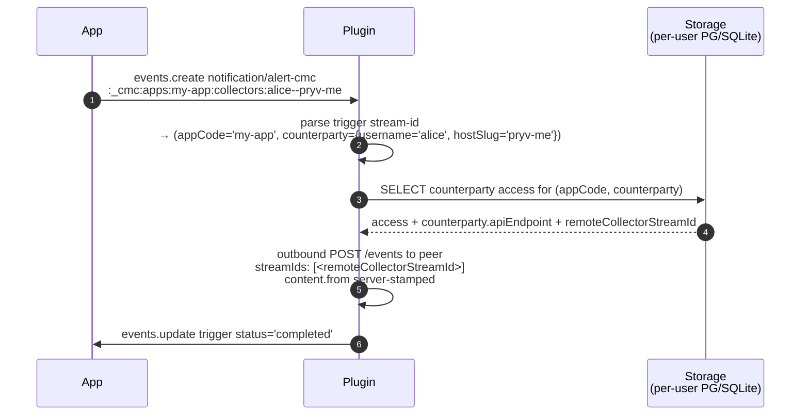

---

# 8. Scope-request orchestration (collector side, permission-chain pre-validation)

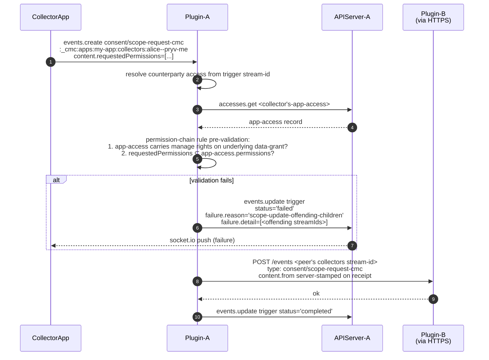

**Why pre-validate on the collector side:** invalid scope requests are caught before bothering the user. The user's plugin re-validates on receipt as defense-in-depth, but the common case is the collector's app catches its own mistakes.

---

# 9. Scope-update: user accepts; `accesses.update`

```mermaid
sequenceDiagram
    autonumber
    participant UserApp
    participant Plugin as Plugin-B
    participant APIServer as APIServer-B
    participant Storage as Storage-B<br/>(per-user PG/SQLite)
    participant Peer as Plugin-A

    UserApp->>Plugin: events.create consent/scope-update-cmc<br/>content.scopeRequestEventId<br/>content.accept=true
    Plugin->>Storage: mall.events.getOne scopeRequestEventId<br/>(the request as it arrived on this account)
    Storage-->>Plugin: scope-request event<br/>(newPermissions, createdBy, streamIds)
    Plugin->>Plugin: bind: createdBy is the counterparty grant serving<br/>the request's collectors stream; answer on that same stream;<br/>not expired; not answered by another trigger
    Plugin->>Plugin: runWithSuppression<br/>(double-fire suppression, see flow 10)
    Plugin->>Storage: mall.accesses.update id=<createdBy grant><br/>permissions=request.newPermissions + :_cmc:* machinery
    Plugin->>Storage: request content: status='accepted', responseEventId
    Plugin->>Plugin: trigger content: accessId, newPermissions, applied=true
    Plugin->>Peer: POST /events <peer's collectors stream-id><br/>type: consent/scope-update-cmc<br/>content (accept, accessId, newPermissions, applied)
    Peer-->>Plugin: ok
    Plugin->>APIServer: events.update trigger status='completed'
    APIServer-->>UserApp: socket.io push
```

`completed` means the grant changed. A binding failure fails the trigger with a `cmc-scope-request-*` reason and changes nothing. On the collector side the completed `consent/scope-request-cmc` trigger carries `content.remoteEventId`, the id this flow must be given.

**Refusal path** (`accept: false`): the request is bound the same way, no update runs, the request is recorded `refused`, the trigger records `applied: false`, and a `consent/scope-update-cmc` with `content.accept=false` is delivered. No local update runs → no post-hook fire → no double-notification.

---

# 10. `accesses.update` post-hook + double-fire suppression

The post-hook fires on every successful `accesses.update`. It detects counterparty accesses and auto-notifies. Double-fire suppression prevents a redundant notification when the CMC trigger handler (flow 9) is the caller.

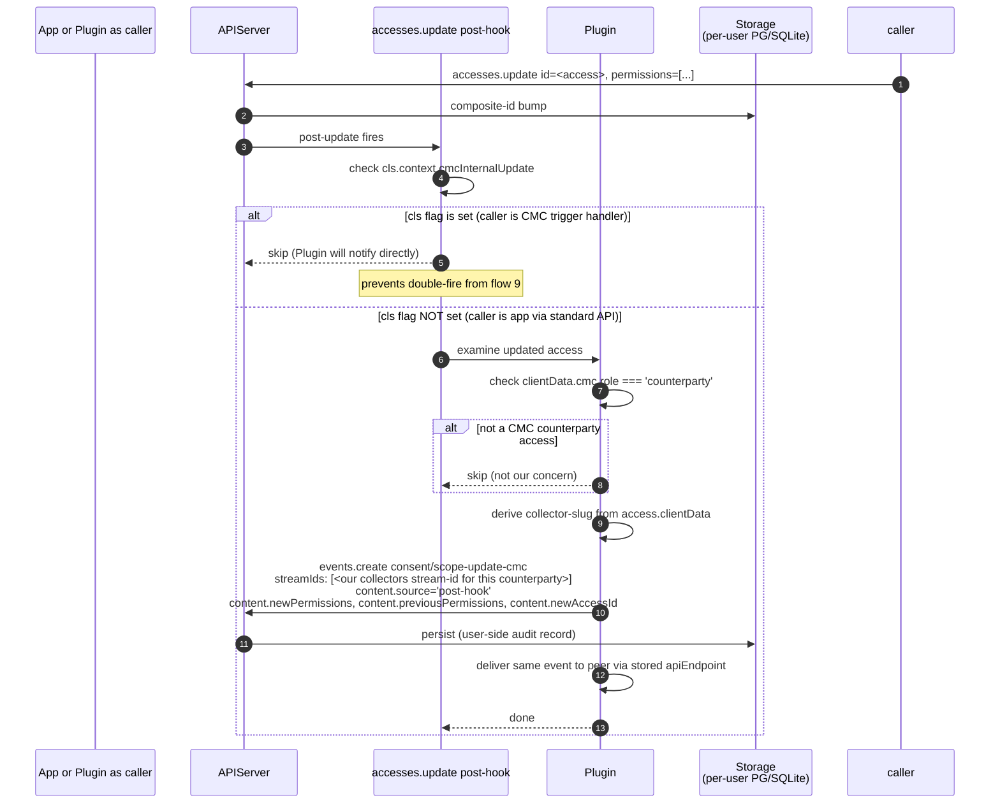

**Double-fire suppression mechanism** (open question 8): proposed using `cls-hooked` continuation-local storage. The trigger handler (flow 9 step 3) sets a flag before calling `accesses.update`; the post-hook reads it; the flag clears at end-of-request. This is the cleanest because it doesn't change `accesses.update`'s API surface and survives async boundaries within the same logical request.

**Failure cases:**
- App calls `accesses.update` against a non-counterparty access → post-hook detects `role !== 'counterparty'` and skips. No-op (correct).
- App calls `accesses.update` against a counterparty access while a CMC trigger is mid-flight → cls is request-scoped, so the two paths don't see each other's flags. The post-hook fires once for the app's call; the trigger handler delivers its own notification for the CMC call. Two notifications for two distinct user actions, correct.
- Concurrent app + CMC updates against the same access → composite-id ensures only one wins; the loser sees `stale-access-id` and retries. The retry path reads fresh permissions and either: skips (already at desired state) or fires the post-hook (legitimate second change).

---

# 11. Slug computation

Deterministic. Helpers ship in `lib-js` and the plugin uses the same code for stream-id construction so client + server agree.

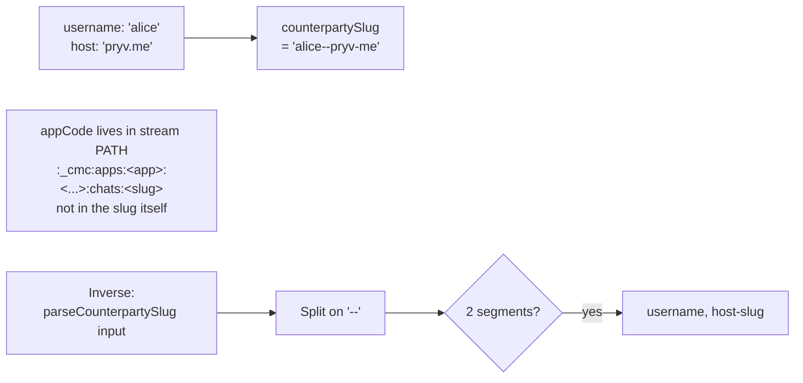

**Why app-code is in the stream PATH, not the slug**: this is what lets the user's access be scoped at the `:_cmc:apps:<app-code>:*` level (whole-app) OR at `:_cmc:apps:<app-code>:<request-slug>:*` (per-request) via natural prefix matching. Putting the app-code into the slug would break that.

**Edge cases to enforce:**
- Username containing `--` is rejected at registration time (user-validation rule).
- Host components containing `--` is impossible (DNS doesn't allow consecutive hyphens in labels).
- Slugs are stable for the lifetime of the relationship (see IMPLEMENTERS-GUIDE.md "Stability" section).

---

# 12. Same-platform same-core in-process short-circuit

When the plugin's outbound apiEndpoint resolves to a local user on the same core, skip HTTPS entirely and dispatch directly into the local API server.

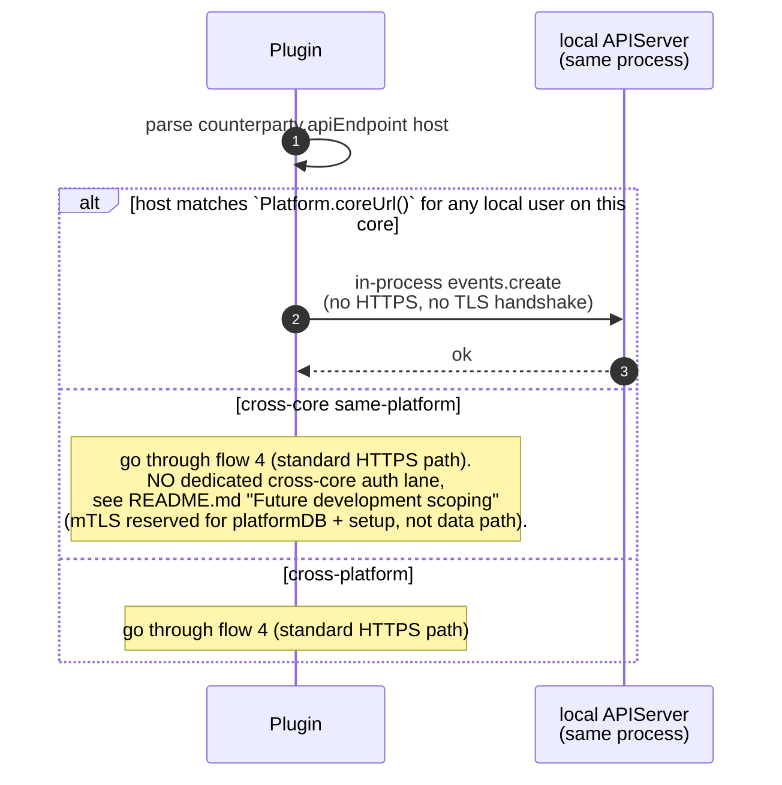

**Cross-core deliveries take the standard HTTPS path**, same as cross-platform. The access token in the apiEndpoint is the auth. We deliberately do NOT short-circuit cross-core via cluster-CA mTLS on `/events`, see README.md "Future development scoping" for the rationale.

---

# 13. Revoke teardown: local delete + peer notification

**Both halves of the pair die, each deleted by the server that hosts it.** The
side writing the trigger deletes the access the peer was using against its own
account, and the receiving side deletes the access the revoke arrived through,
which is the withdrawing side's access on the receiver. Neither server ever
deletes anything on the other; each acts on its own data, in response to an
event the peer authenticated with the very access being destroyed.

> **Earlier behaviour, for anyone reading an older deployment.** Until the
> peer-side teardown landed, the receiving side ran no handler at all and the
> withdrawing side's token kept working until that side's app deleted it. If
> you are running a build without `handleIncomingRevoke`'s teardown, revocation
> is enforced only in the local direction and an app that observes a
> `consent/revoke-cmc` arrival is responsible for deleting its own half.

Either party writes `consent/revoke-cmc`. Their plugin deletes their local access(es) and notifies the peer. The anchor streams (`:_cmc:apps:<app-code>:[<path>:]chats:*`, `:_cmc:apps:<app-code>:[<path>:]collectors:*`) are **left in place** so history is preserved; future re-engagement starts a fresh request → accept cycle and the existing streams get reused.

**What the receiving side does with the arrival.** `handleIncomingRevoke`
(reached because dispatch routes a revoke on `:_cmc:inbox` to the incoming path)
does three things, in this order:

1. **Enforce** — delete the access the revoke arrived through, plus any sibling
   access with the same stamped counterparty and the same non-null
   `scopeStreamId`. Several grants can serve one relationship, since the
   accepter mints a new one on every accept while the requester heals one in
   place, and each of those handed out a live token. Scope-less legacy accesses
   are never swept: without a scope, one relationship with a peer cannot be
   told from another under the same app code.

   **The bound on the sweep.** "Same counterparty" means the identity stamped on
   the access at accept time, which on the accepter side comes from the offer
   (`inferCounterparty` prefers the offer's asserted requester username / host
   over the capability URL's host). The sweep therefore trusts exactly the
   requester identity the accept already trusted, and no more: an accepted
   offer that lied about who the requester is could see a revoke tear down
   another grant stamped with that same claimed identity and scope. That is the
   identity model's existing limit, which previously showed up as misrouted
   deliveries; it is not widened here, but it does become a deletion rather than
   a misroute. A deployment that cares about this should care about it at the
   accept, which is the only point where the claim can still be refused.
2. **Bookkeep** — on the requester side, mark the single-use invite the
   relationship descends from `revoked` on its `consent/request-cmc` trigger.
   An open-link invite needs nothing: the deleted access was the subject's
   join, so the same link accepts them again.
3. **Enrich** — add this side's own handles to the inbox event, see below.

The order is deliberate. A failure between 1 and 2 leaves a stale invite
status, which is cosmetic; the reverse order would leave a live token. The handler issues no outbound call, and its
deletes go through the mall rather than the api-server route, so they do not
fire the accesses-delete hook and cannot loop.

**Correlation ids on the arrival.** `content.accessId` is the SENDER's access id
and means nothing on the receiving account, so the receiver adds the ids its own
app already holds: `backChannelAccessId` + `inviteEventId` on the requester
side, `dataGrantAccessId` + `offerEventId` + `acceptEventId` on the accepter
side, and on both `scopeStreamId` (server-derived, not the peer's claim) plus
`revokedAccessIds`, the local accesses the teardown destroyed. An id that cannot
be resolved is left out rather than written as null, and a value the peer
supplied is never overwritten. The requester's back-channel access is also
stamped with `offerEventId` / `inviteEventId` at mint, so a peer on an older
build still receives something matchable.

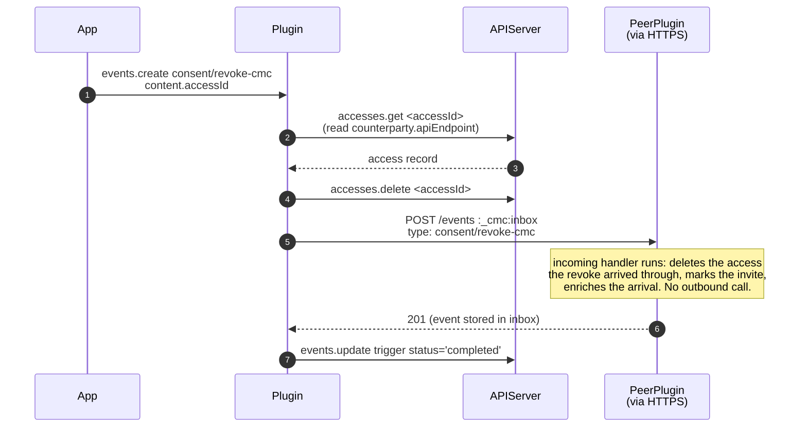

Note that `status: 'completed'` on the trigger means "local teardown done and the
notification was accepted by the peer". The peer's own teardown runs after it
answers 201 and is not reported back, so `completed` is not a receipt for it. A
delivery that never succeeds leaves the peer's half standing: on that side the
relationship access outlives the relationship until an operator prunes it, which
is the residual cost of best-effort delivery.

**Anchor stream history preservation:** chat + collector streams are NOT deleted on revoke. They become orphan-but-readable; the user can still scroll history. If the two parties later re-accept, the plugin re-creates the access pair pointing at the existing streams. (Re-acceptance is exercised by the handshake suite's revoke and re-accept cases.)

**Delivery is best-effort and requires a peer endpoint.** Each side can only notify the other once the back-channel handshake has stored the peer's `apiEndpoint` on the relationship access. If that never completed, or if delivery fails, the revoke currently no-ops with a log warning, no error surfaced to the caller and no retry. Retry-queue integration is planned.

---

# 14. Cross-platform e2e validation

Full end-to-end across two independent open-pryv.io platforms with different operators. This is the scenario that proves federation works without shared CA or shared user namespace.

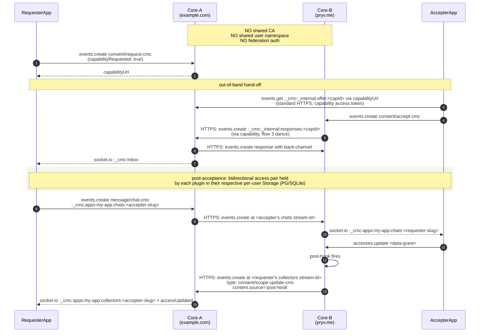

**TLS:** each plugin's outbound HTTPS uses standard public-CA-validated TLS to the peer's domain. No mTLS, no shared cluster CA. The access token in the `apiEndpoint` URL is the auth.

**Topology invariance:** works for `dnsLess: true` on either side, mixed topologies, etc., because all addressing is through `apiEndpoint` URLs, which the receiving platform serves at its own DNS / port.

---

# Access-state-mutating triggers: token-class + access-permission gates

The CMC lifecycle triggers that **mint, widen, or delete** data-grant accesses on the recipient's account are gated. Two distinct gate shapes, chosen per trigger by what the orchestrator does with the access state:

| Trigger | Gate at `events.create` | Per-handler permission check | Rationale |
|---|---|---|---|
| `consent/accept-cmc` (mint) | Personal-token only (`cmcAcceptAccessGateHook`); a delegate token is personal-type and passes (see [Accept by a delegate](#accept-by-a-delegate-account-delegation)) | `triggerAccess.canCreateAccess(dataGrantPayload)` in `handleAccept`; for a delegate, the relationship check before and after the mint | New access on the user's account → no existing access bounds the chain; user-presence enforced by the personal-token gate. |
| `consent/scope-update-cmc` (widen) | Personal-token only (same hook) | `triggerAccess.canUpdateAccess(target)` + `triggerAccess.canCreateAccess({permissions: mergedPerms, type: 'shared'})` in `handleSystemScopeUpdate` | Widens an existing access → user-presence enforced; chain check mirrors `accesses.update`'s `applyPrerequisitesForUpdate`. |
| `consent/revoke-cmc` (delete) | NOT in the personal-token gate | `triggerAccess.canDeleteAccess(target)` in `handleRevoke` (per delete; covers data-grant + counterparty) | Contraction, not escalation, the target access bounds the impact. The standard `canDeleteAccess` honours the `selfRevoke` feature permission, so the relationship's own data-grant access can self-revoke from any holder. |

## Why personal-token at all (mint + widen)

The orchestration treats the trigger event as authoritative consent, for accept it reads the offer through the capability connection, mints a `shared` data-grant access with permissions derived from the offer, and delivers the accept back to the requester. Without the gate, an app holding only `:_cmc:apps:<app>:*, contribute` could write `consent/accept-cmc` carrying a colluding requester's offer and have the recipient's plugin mint a much broader access on the user's account with no consent UI shown. Requiring a personal token at mint/widen means the user is provably signed in at the moment the trigger is recorded.

## Why NOT personal-token for revoke

Revoke deletes accesses; the access being deleted already bounds the impact. Forcing personal-token would prevent the relationship's data-grant access (held by the peer) from terminating its own side of the relationship without bouncing through the auth pages, clumsy UX with no security benefit. The standard `AccessLogic.canDeleteAccess` rule covers:
- personal token → always passes;
- the access being deleted is the same as the trigger writer (self-revoke), AND the target's `selfRevoke` feature permission isn't `forbidden` → passes (default allow);
- an app token that created the access → passes;
- anything else → rejected with `cmc-revoke-forbidden`.

This matches what the `accesses.delete` route enforces, same primitive, no parallel implementation.

## Where the code lives

- **Mint/widen gate**: `src/cmcAcceptAccessGate.ts` exports `createCmcAcceptAccessGateHook({errors})`. Wired into the `events.create` middleware chain right after `cmcContentValidationHook`. Uses `AccessLogic.isPersonal()`.
- **Per-handler chain checks** (defense in depth, the gate is the primary guard for mint/widen, but the handlers also run the check so any future bypass doesn't re-open the surface):
  - `handleAccept` → `triggerAccess.canCreateAccess(payload)` before `mall.accesses.create`. Failure: `cmc-insufficient-permissions`.
  - `handleSystemScopeUpdate` → `triggerAccess.canUpdateAccess(target)` + `triggerAccess.canCreateAccess({permissions: mergedPerms, type: 'shared'})` before `mall.accesses.update`. Failure: `cmc-insufficient-permissions`.
  - `handleRevoke` → `triggerAccess.canDeleteAccess(target)` before each `mall.accesses.delete` (this is the primary guard for revoke since there's no events.create gate). Failure: `cmc-revoke-forbidden`.
- The trigger-writer's `AccessLogic` is plumbed through `dispatch.ts`'s per-request deps (`triggerAccess: context?.access`) so the handlers can reach it.

## Rejection shapes

| Outcome | Wire shape |
|---|---|
| Mint/widen gate rejection | `HTTP 400 invalid-operation` + `error.data.id === 'cmc-accept-requires-personal-token'` + `error.data.eventType === '<rejected>'` |
| Handler chain-check failure (mint/widen) | trigger event persisted with `content.status === 'failed'` + `content.failure.reason === 'cmc-insufficient-permissions'` |
| Revoke permission failure | trigger event persisted with `content.status === 'failed'` + `content.failure.reason === 'cmc-revoke-forbidden'` |

All ids match the existing CMC error convention (top-level `invalid-operation`, CMC id under `error.data.id`).

## Exemption for the mint/widen gate: plugin-managed accesses pass through

The hand-off + delivery paths the CMC plugin orchestrates itself use accesses that aren't personal but legitimately carry lifecycle event types:

- **`clientData.cmc.kind === 'capability'`**: the one-shot capability access POSTs `consent/accept-cmc` into the requester's `:_cmc:_internal:responses:<capId>` stream as part of step 3 of the accept flow. Without the exemption this cross-platform protocol message would be rejected.
- **`clientData.cmc.role === 'counterparty'`**: bidirectional shared accesses created at acceptance deliver follow-up protocol events (`consent/back-channel-cmc`, inbox mirrors of subsequent triggers) into the peer's mall.

Both markers are plugin-stamped at mint time (`capability.ts` / `acceptOrchestration.ts`). User-initiated triggers never carry them; an app trying to spoof the marker is blocked by the existing `cmc-clientdata-cmc-forbidden` forge-prevention hook on `accesses.create` / `accesses.update`.

Revoke needs no equivalent exemption: peer-delivered revokes are short-circuited as `'skipped'` by dispatch's `isPeerDeliveredEvent` check on `OUTBOUND_LOOPABLE_TYPES` before `handleRevoke` runs.

## Accept by a delegate (account delegation)

A delegate token (account delegation) is personal-type, so it passes the mint gate. The delegation plugin's own events.create guard (`delegation-grant-requires-owner`) is fed `consent/scope-update-cmc` and `consent/request-cmc` only: the accept's grant records the delegation lineage, the other two paths do not.

- **Stamp at write time** (`acceptServerOwnedFieldsHook.ts`, wired after the mint gate): the server-owned fields of an accept (`constants.ACCEPT_SERVER_OWNED_FIELDS`: `approvedBy`, `ownerConfirmedAt`, `withdrawal`) are deleted from any client create; when the writing access is delegation-derived, `approvedBy = { delegate: { username, hostSlug? }, relId }` is set from its marker. The marker is read by the delegation plugin's `lineageOf`, injected by the api-server (this plugin imports nothing from the delegation plugin). On `events.update` the stored values are put back (`createAcceptPreserveHook`). Server writers (dispatch status stamps, the incoming accept, detach, the withdrawal marker) go through the mall and never reach these hooks.
- **Lineage on the grant** (`handleAccept`, step 3c): `lineageOf(triggerAccess)` on live dispatch; on a retry (no request context) the access named by the trigger's `createdBy`, kept in the retry snapshot as `originalCreatedBy`. The marker `{ kind: 'delegated-child', relId, delegate, viaAccessId }` goes on `clientData.delegation` beside `clientData.cmc`; a grant reused from an earlier dispatch of the same accept is updated with it. A recorded `approvedBy` whose lineage cannot be resolved, or names another relationship, fails the accept.
- **The delegation must stand when the grant exists**: `relationshipExists(userId, relId)` (the api-server wires the relationship anchor lookup) before the mint; after it, the anchor again plus the approving access with the same marker (detach deletes that access first, then sweeps the relationship's marked accesses). A failed check deletes a freshly minted grant. Failure: `cmc-handler-delegation-ended`, non-retryable. Deps not wired: never mint a delegate's grant.
- **Detach** (delegation plugin): deletes the relationship's marked accesses, consent grants included, then hands the consent grants (as they were before deletion) to the api-server, which runs the `accesses.delete` post-hook on them (flow 13's raw-delete notification): the requester receives `consent/revoke-cmc`. A `consent/revoke-cmc` trigger through `handleRevoke` was not used: its local delete runs after the delivery attempts, and the dispatch middleware does not await it. A grant deleted by a detach between the post-mint check and the back-channel handshake (delivery to the requester, up to the 15 s timeout, plus the requester's processing) is revoked without notice: the raw-delete forwarding has no peer endpoint yet (`cmc-revoke-no-peer-endpoint` in the log) and the requester learns of it on first use of the token (401/403).
- **The owner's review at detach** (`keepAccessIds`): a kept grant loses `clientData.delegation` and its accept event gets `ownerConfirmedAt`; a dropped one is deleted as above and its accept event gets `withdrawal = { at, by: 'delegation-detach', relId }`. Both markers are written by the delegation plugin through the mall, best-effort, and are server-owned (above), so the per-grant record on the managed account cannot be written or erased through the API.
- **Withdrawal on every teardown path** (`acceptWithdrawal.ts`): detach is not the only way a consent ends, and the accept event is the person's own record of it, so every path marks it the same way: `content.withdrawal = { at, by, accessId, revokeEventId? }` (`at` in seconds), with `by: 'accesses.delete'` (the data grant deleted through the API, accesses-delete post-hook), `'revoke-cmc'` (a `consent/revoke-cmc` written by the person, `handleRevoke`; `revokeEventId` is the trigger) or `'peer-revoke'` (the requester withdrew, `handleIncomingRevoke`, once per grant the teardown destroyed; `revokeEventId` is the inbox arrival). Detach keeps its own `{ at, by: 'delegation-detach', relId }`. Rules: accepter side only (the grant's `acceptEventId` is local; the requester's back-channel carries a `capabilityId` key and the peer's id, and its record is the invite stamped `revoked`); the target must be a `consent/accept-cmc`; the first writer wins among writers in sequence (detach stamps before it hands the grants to the post-hook, and a hook that fires twice in sequence writes once); the check is a read then a write, not a compare-and-set, so concurrent stampers (a raw delete racing a `consent/revoke-cmc` for the same grant) may both write, the later record winning with the same `accessId`; `handleRevoke` stamps only once the grant's delete succeeded; the write is versioned (no `skipVersioning`) and goes through the mall, so integrity is recomputed; best-effort, it never fails the delete, the peer delivery or the trigger. A relationship minted before `acceptEventId` was stamped on the grant has nothing to mark. The accesses-delete post-hook is fire-and-forget, so the mark may land shortly after the delete answers; the api-server passes it a per-call `notifyEventChanged`, so the user's socket clients receive `eventsChanged` when it does.

## `handleIncomingAccept` back-channel mint stays direct

`handleIncomingAccept.ts:233` still calls `mall.accesses.create` for the back-channel mint without chain check. The runtime context is a capability access (never personal); a chain check would fail by design. The back-channel's permissions are bounded by the original request, which was chain-checked requester-side at `consent/request-cmc` publish time. Intentional + documented.

## Hand-off for apps without a personal token

- **Accept**: `@pryv/cmc.requestAccept` / `requestAcceptUrl` open `app-web-user-account`'s `/cmc-accept` page; the user signs in, the page writes the trigger with the fresh personal token, the data-grant apiEndpoint is returned via popup `postMessage` or `returnUrl` redirect. (`app-web-user-account` is the React auth+account web app; it replaces the deprecated `app-web-auth3`.)
- **Scope-update**: `@pryv/cmc.requestScopeUpdate` / `requestScopeUpdateUrl` open `app-web-user-account`'s `/cmc-scope-update` page; same shape, input is `scopeRequestEventId` instead of `capabilityUrl`.
- **Revoke**: no hand-off helper exists or is needed. `cmc.revokeAcceptance` / `cmc.revokeRelationship` work from any access that satisfies `canDeleteAccess` on the target (the relationship's own data-grant access by default).

---

# Open questions (not blockers for this doc)

- Capability TTL default + override policy: settled: 7 d default, [60 s, 30 d] per-invite, open-link may opt out ([#137](https://github.com/pryv/open-pryv.io/issues/137)).
- Per-host queue / backpressure in retry loop.
- Operator audit visibility of capability accesses + the hidden `:_cmc:_internal:retries` stream.
- Anchor stream removal policy on revoke (currently: never; alternative: TTL-based archive).
- Quota numbers + critical-level allowance shape.
- Outbound egress operator policy (open vs allow-list).

---

# Out-of-scope flows (for completeness: not in v1)

- **future federated invite-webhook**: cross-platform directed invite auto-routing. CMC v1 falls back to capability-URL hand-off for cross-platform directed.
- **E2E encryption** of chat / system payloads. Plugin terminates TLS but content lives in plaintext on both platforms' per-user storage. Backlog.
- **Group / many-to-many** broadcast. Apps fan out N individual triggers.
- **Cross-scope state projection** (`:_cmc:state` summary across all `:_cmc:apps:*` regions). v2.
- **Username / host migration**: would require slug-rename atomic transaction. Out of v1.
